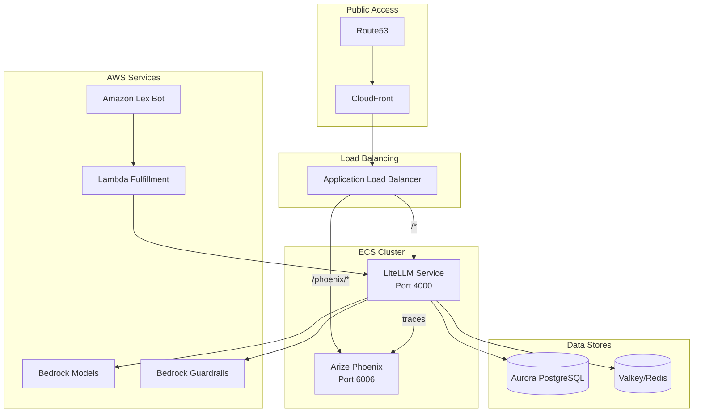

# Design Document: LiteLLM ECS Demo with Arize Phoenix

## Overview

This design extends the existing LiteLLM ECS infrastructure to add Arize Phoenix for LLM observability, CloudFront/Route53 for public access, and Amazon Lex for a Q&A chatbot interface. The solution uses AWS Bedrock models exclusively with guardrails and intelligent routing.

### Key Components
1. **Arize Phoenix ECS Service** - Self-hosted observability platform
2. **Enhanced ALB** - Path-based routing to LiteLLM and Phoenix
3. **CloudFront Distribution** - CDN with HTTPS termination
4. **Amazon Lex Bot** - Q&A chatbot with Lambda fulfillment
5. **Bedrock Guardrails** - Content filtering and safety controls
6. **SQuAD Evaluation Dataset** - Ground truth for LLM evaluation

## Architecture



## Components and Interfaces

### 1. Arize Phoenix ECS Service

**Container Configuration:**
```hcl
container_definitions = jsonencode([{
  name      = "phoenix-container"
  image     = "arizephoenix/phoenix:latest"
  essential = true
  portMappings = [{
    containerPort = 6006
    hostPort      = 6006
    protocol      = "tcp"
  }]
  environment = [
    { name = "PHOENIX_WORKING_DIR", value = "/phoenix" }
  ]
}])
```

**Service Configuration:**
- Fargate launch type (same as LiteLLM)
- Shared VPC networking with LiteLLM
- Health check: `/` endpoint on port 6006

### 2. LiteLLM Configuration with Arize Phoenix Integration

**config.yaml:**
```yaml
model_list:
  - model_name: claude-3-sonnet
    litellm_params:
      model: bedrock/anthropic.claude-3-sonnet-20240229-v1:0
      aws_region_name: us-east-1
  - model_name: claude-3-haiku
    litellm_params:
      model: bedrock/anthropic.claude-3-haiku-20240307-v1:0
      aws_region_name: us-east-1
  - model_name: titan-text
    litellm_params:
      model: bedrock/amazon.titan-text-express-v1
      aws_region_name: us-east-1

router_settings:
  routing_strategy: "cost-based-routing"  # or "latency-based-routing"
  num_retries: 3
  timeout: 60

litellm_settings:
  callbacks: ["arize_phoenix"]
  guardrails:
    - guardrail_name: "bedrock-content-filter"
      litellm_params:
        guardrail_id: "${BEDROCK_GUARDRAIL_ID}"
        guardrail_version: "DRAFT"

general_settings:
  master_key: "${LITELLM_MASTER_KEY}"

environment_variables:
  PHOENIX_COLLECTOR_HTTP_ENDPOINT: "http://phoenix-service:6006/v1/traces"
  PHOENIX_PROJECT_NAME: "litellm-demo"
```

### 3. ALB Path-Based Routing

**Listener Rules:**
```hcl
# Rule 1: Phoenix UI (priority 100)
resource "aws_lb_listener_rule" "phoenix" {
  listener_arn = aws_lb_listener.https.arn
  priority     = 100
  
  action {
    type             = "forward"
    target_group_arn = aws_lb_target_group.phoenix.arn
  }
  
  condition {
    path_pattern {
      values = ["/phoenix/*"]
    }
  }
}

# Rule 2: Default to LiteLLM (priority 200)
resource "aws_lb_listener_rule" "litellm" {
  listener_arn = aws_lb_listener.https.arn
  priority     = 200
  
  action {
    type             = "forward"
    target_group_arn = aws_lb_target_group.litellm.arn
  }
  
  condition {
    path_pattern {
      values = ["/*"]
    }
  }
}
```

### 4. CloudFront Distribution

```hcl
resource "aws_cloudfront_distribution" "main" {
  origin {
    domain_name = aws_lb.main.dns_name
    origin_id   = "alb-origin"
    
    custom_origin_config {
      http_port              = 80
      https_port             = 443
      origin_protocol_policy = "https-only"
      origin_ssl_protocols   = ["TLSv1.2"]
    }
  }
  
  default_cache_behavior {
    allowed_methods        = ["GET", "HEAD", "OPTIONS", "PUT", "POST", "PATCH", "DELETE"]
    cached_methods         = ["GET", "HEAD"]
    target_origin_id       = "alb-origin"
    viewer_protocol_policy = "redirect-to-https"
    
    forwarded_values {
      query_string = true
      headers      = ["Authorization", "Host"]
      cookies { forward = "all" }
    }
  }
  
  restrictions {
    geo_restriction { restriction_type = "none" }
  }
  
  viewer_certificate {
    acm_certificate_arn = aws_acm_certificate.main.arn
    ssl_support_method  = "sni-only"
  }
}
```

### 5. Amazon Lex Bot with Lambda Fulfillment

**Lex Bot Configuration:**
```hcl
resource "aws_lexv2models_bot" "qa_assistant" {
  name         = "QAAssistant"
  description  = "General Q&A chatbot powered by LiteLLM"
  role_arn     = aws_iam_role.lex_role.arn
  
  data_privacy {
    child_directed = false
  }
  
  idle_session_ttl_in_seconds = 300
}

resource "aws_lexv2models_intent" "fallback" {
  bot_id      = aws_lexv2models_bot.qa_assistant.id
  bot_version = "DRAFT"
  locale_id   = "en_US"
  name        = "FallbackIntent"
  
  fulfillment_code_hook {
    enabled = true
  }
}
```

**Lambda Fulfillment Function:**
```python
import json
import urllib3

LITELLM_ENDPOINT = os.environ['LITELLM_ENDPOINT']
LITELLM_API_KEY = os.environ['LITELLM_API_KEY']

def lambda_handler(event, context):
    user_message = event['inputTranscript']
    
    http = urllib3.PoolManager()
    response = http.request(
        'POST',
        f"{LITELLM_ENDPOINT}/chat/completions",
        headers={
            'Authorization': f'Bearer {LITELLM_API_KEY}',
            'Content-Type': 'application/json'
        },
        body=json.dumps({
            'model': 'claude-3-sonnet',
            'messages': [{'role': 'user', 'content': user_message}]
        })
    )
    
    result = json.loads(response.data.decode('utf-8'))
    assistant_message = result['choices'][0]['message']['content']
    
    return {
        'sessionState': {
            'dialogAction': {'type': 'Close'},
            'intent': {'name': event['sessionState']['intent']['name'], 'state': 'Fulfilled'}
        },
        'messages': [{'contentType': 'PlainText', 'content': assistant_message}]
    }
```

### 6. Bedrock Guardrails

```hcl
resource "aws_bedrock_guardrail" "content_filter" {
  name        = "litellm-content-filter"
  description = "Content filtering for LiteLLM demo"
  
  blocked_input_messaging  = "Your request contains content that cannot be processed."
  blocked_outputs_messaging = "The response was filtered due to content policy."
  
  content_policy_config {
    filters_config {
      type            = "HATE"
      input_strength  = "HIGH"
      output_strength = "HIGH"
    }
    filters_config {
      type            = "VIOLENCE"
      input_strength  = "HIGH"
      output_strength = "HIGH"
    }
    filters_config {
      type            = "SEXUAL"
      input_strength  = "HIGH"
      output_strength = "HIGH"
    }
  }
  
  sensitive_information_policy_config {
    pii_entities_config {
      type   = "EMAIL"
      action = "ANONYMIZE"
    }
    pii_entities_config {
      type   = "PHONE"
      action = "ANONYMIZE"
    }
  }
}
```

## Data Models

### SQuAD Dataset Schema (for Phoenix Evaluation)

```python
# Phoenix Dataset structure
{
    "name": "squad-qa-evaluation",
    "description": "SQuAD Q&A pairs for LLM evaluation",
    "examples": [
        {
            "input": {
                "question": "What is the capital of France?",
                "context": "France is a country in Western Europe. Paris is the capital and largest city of France."
            },
            "output": {
                "answer": "Paris"
            },
            "metadata": {
                "source": "squad",
                "difficulty": "easy"
            }
        }
    ]
}
```

### LiteLLM Trace Schema (sent to Phoenix)

```json
{
    "trace_id": "abc123",
    "span_id": "span456",
    "name": "litellm.completion",
    "attributes": {
        "llm.model": "bedrock/anthropic.claude-3-sonnet",
        "llm.input_messages": [...],
        "llm.output_messages": [...],
        "llm.token_count.prompt": 150,
        "llm.token_count.completion": 200,
        "llm.latency_ms": 1250,
        "llm.cost": 0.0045
    }
}
```


## Correctness Properties

*A property is a characteristic or behavior that should hold true across all valid executions of a system—essentially, a formal statement about what the system should do. Properties serve as the bridge between human-readable specifications and machine-verifiable correctness guarantees.*

Based on the prework analysis, the following testable properties have been identified:

### Property 1: Bedrock Model Configuration Validation

*For any* model entry in the LiteLLM config.yaml, the model parameter SHALL start with "bedrock/" prefix, ensuring only AWS Bedrock models are used.

**Validates: Requirements 1.4**

### Property 2: ALB Path-Based Routing Correctness

*For any* HTTP request to the ALB, the request SHALL be routed to the correct target group based on path pattern:
- Requests matching `/phoenix/*` → Phoenix target group
- All other requests → LiteLLM target group (default)

**Validates: Requirements 2.1, 2.2, 2.3**

### Property 3: Lex-LiteLLM Integration Round-Trip

*For any* user message sent to the Lex bot, the message SHALL flow through Lambda to LiteLLM and the response SHALL be returned to the user via Lex, preserving the semantic content of the LLM response.

**Validates: Requirements 3.3, 3.4**

## Error Handling

### ECS Service Failures
- **Phoenix container crash**: ECS auto-restarts container; LiteLLM continues without tracing
- **LiteLLM container crash**: ECS auto-restarts; ALB health check removes unhealthy tasks

### Network Errors
- **Phoenix unreachable**: LiteLLM logs warning but continues processing requests (non-blocking callback)
- **Bedrock API timeout**: LiteLLM retries based on `router_settings.num_retries` (default: 3)

### Guardrail Triggers
- **Content blocked**: Return configured `blocked_input_messaging` or `blocked_outputs_messaging`
- **PII detected**: Anonymize sensitive data per guardrail configuration

### Lex/Lambda Errors
- **Lambda timeout**: Lex returns fallback message "Sorry, I couldn't process your request"
- **LiteLLM unreachable**: Lambda returns error message to Lex

## Testing Strategy

### Unit Tests
Unit tests verify specific examples and edge cases:

1. **Terraform validation**: `terraform validate` and `terraform plan` for syntax/configuration
2. **Lambda function**: Test handler with mock Lex events
3. **Config parsing**: Verify LiteLLM config.yaml structure

### Property-Based Tests
Property tests verify universal properties across all inputs using **pytest** with **hypothesis** library:

**Test Configuration:**
- Minimum 100 iterations per property test
- Tag format: `Feature: litellm-ecs-demo, Property N: <property_text>`

```python
# Property 1: Bedrock Model Configuration
@given(config=st.from_type(LiteLLMConfig))
@settings(max_examples=100)
def test_all_models_use_bedrock(config):
    """Feature: litellm-ecs-demo, Property 1: Bedrock Model Configuration"""
    for model in config.model_list:
        assert model.litellm_params.model.startswith("bedrock/")

# Property 2: ALB Routing (integration test)
@given(path=st.text(min_size=1))
@settings(max_examples=100)
def test_alb_routes_correctly(path):
    """Feature: litellm-ecs-demo, Property 2: ALB Path-Based Routing"""
    if path.startswith("/phoenix"):
        expected_service = "phoenix"
    else:
        expected_service = "litellm"
    # Verify routing logic

# Property 3: Lex Round-Trip (integration test)
@given(message=st.text(min_size=1, max_size=500))
@settings(max_examples=100)
def test_lex_litellm_roundtrip(message):
    """Feature: litellm-ecs-demo, Property 3: Lex-LiteLLM Round-Trip"""
    # Send message to Lex, verify response received
    pass
```

### Integration Tests
1. **End-to-end flow**: Send request through CloudFront → ALB → LiteLLM → Bedrock
2. **Tracing verification**: Confirm traces appear in Phoenix after LiteLLM requests
3. **Lex chatbot flow**: Send message to Lex, verify LLM response returned

### SQuAD Evaluation Tests
Using Arize Phoenix Datasets API:
1. Load SQuAD subset (100 examples)
2. Run LLM inference on questions
3. Compare responses to ground truth using:
   - Exact Match (EM)
   - F1 Score
   - Semantic Similarity
