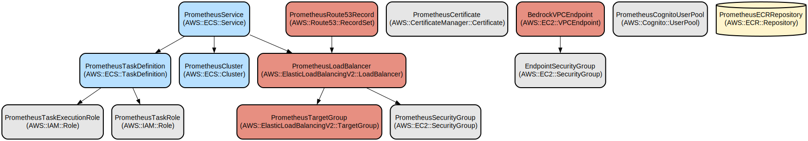

# Prometheus - Secure Internal AI Assistant for Document Analysis and Corporate Knowledge

Prometheus is a secure, AWS-based AI assistant that helps employees analyze documents and access corporate knowledge across departments like HR, IT, Legal, Finance, and Procurement. It combines document processing capabilities with natural language interactions, all protected by AWS Cognito authentication.

The application provides real-time document analysis for various file formats (PDF, Word, Excel, CSV) and maintains contextual conversations through AWS Bedrock's language models. Built with Streamlit and deployed on AWS ECS, Prometheus offers a user-friendly interface while maintaining enterprise-grade security and scalability. The system intelligently processes uploaded documents, extracts relevant information, and provides natural language interactions about the content while clearly distinguishing between internal knowledge and general information.

## Repository Structure
```
.
├── app/                           # Core application code
│   ├── llm.py                    # AWS Bedrock integration for LLM functionality
│   ├── streamlit_app.py          # Main Streamlit application interface
│   ├── utils.py                  # Document processing utilities
│   └── requirements.txt          # Python dependencies for the application
├── terraform/                     # Infrastructure as Code
│   └── products/prometheus/      # Terraform configurations for AWS deployment
├── Dockerfile                    # Container definition for application deployment
├── ecr-build-push.sh            # Script for building and pushing to AWS ECR
├── checkov.yaml                  # Security compliance configuration
└── requirements.txt             # Development dependencies
```

## Usage Instructions
### Prerequisites
- AWS Account with access to:
  - AWS Bedrock
  - AWS Cognito
  - AWS ECR
  - AWS ECS
  - AWS Route 53
- Docker installed locally
- AWS CLI configured with appropriate credentials
- Terraform >= 0.14
- Python 3.11+

### Installation

#### Local Development
```bash
# Clone the repository
git clone <repository-url>
cd prometheus

# Create and activate virtual environment
python -m venv venv
source venv/bin/activate  # On Windows: .\venv\Scripts\activate

# Install development dependencies
pip install -r requirements.txt
pip install -r app/requirements.txt

# Set required environment variables
export POOL_ID="your-cognito-pool-id"
export APP_CLIENT_ID="your-cognito-client-id"
export APP_CLIENT_SECRET="your-cognito-client-secret"

# Run the application locally
cd app
streamlit run streamlit_app.py
```

#### Docker Deployment
```bash
# Build and push to ECR
./ecr-build-push.sh
```

### Quick Start
1. Access the Prometheus web interface
2. Log in using your Cognito credentials
3. Upload a document (supported formats: PDF, Word, CSV, Excel, Text)
4. Click "Process Document" to analyze the content
5. Use the chat interface to ask questions about the document

### More Detailed Examples

#### Document Analysis
```python
# Example: Analyzing a PDF report
1. Upload your PDF file
2. Click "Process Document"
3. Ask: "What are the key findings in this report?"
4. Prometheus will analyze the content and provide a structured response
```

#### Data Analysis
```python
# Example: Analyzing spreadsheet data
1. Upload your CSV/Excel file
2. Click "Process Document"
3. Ask: "What are the main trends in this data?"
4. Prometheus will analyze the numerical data and provide insights
```

### Troubleshooting

#### Common Issues

1. Authentication Failures
```bash
# Check Cognito configuration
aws cognito-idp describe-user-pool --user-pool-id YOUR_POOL_ID
```

2. Document Processing Errors
- Ensure file format is supported
- Check file size (max 10MB)
- Verify file is not corrupted

3. AWS Bedrock Connection Issues
```bash
# Verify VPC endpoint configuration
aws ec2 describe-vpc-endpoints --filters Name=service-name,Values=com.amazonaws.*.bedrock
```

## Data Flow
Prometheus processes documents and queries through a secure, multi-stage pipeline that ensures data privacy and accurate responses.

```ascii
User Request → Cognito Auth → Streamlit Frontend → Document Processing
     ↓                                                    ↓
AWS Bedrock ←────────── Processed Content ←──── Text Extraction
     ↓
Response Generation → Streamlit Frontend → User Display
```

Key Component Interactions:
1. Authentication flow through AWS Cognito
2. Document processing in isolated containers
3. Secure AWS Bedrock API calls through VPC endpoints
4. Stateless processing with session management
5. Load-balanced request handling

## Infrastructure



### Compute Resources
- ECS Cluster for application hosting
- Fargate tasks for serverless container execution
- Application Load Balancer for traffic distribution

### Security
- Cognito User Pool for authentication
- Private VPC endpoints for AWS services
- ACM certificates for TLS termination

### Networking
- Route 53 DNS management
- VPC with private subnets
- Security groups for access control

### Storage
- ECR for container images
- CloudWatch for logging

## Deployment

### CI/CD Pipeline Prerequisites
- Terraform installed
- AWS credentials configured
- Docker installed
- GitLab CI/CD runner with appropriate tags
- Access to required ECR repositories

### Deployment Steps
The deployment process is fully automated through GitLab CI/CD pipelines:

1. Validation Stage
```yaml
# Automated checks run on merge requests and main branch pushes
- Python code formatting (black)
- Python linting (ruff)
- Terragrunt validation
- Infrastructure security scanning (Checkov)
```

2. Build Stage
```yaml
# Automated Docker image build and push to ECR
- Builds application container
- Tags with environment-specific version
- Pushes to AWS ECR repository
```

3. Deployment Stages
```yaml
# Infrastructure deployment through Terragrunt
- Plan stage generates and validates infrastructure changes
- Apply stage (manual trigger) deploys to target environment
- Supports multiple environments (dev, prod)
```
