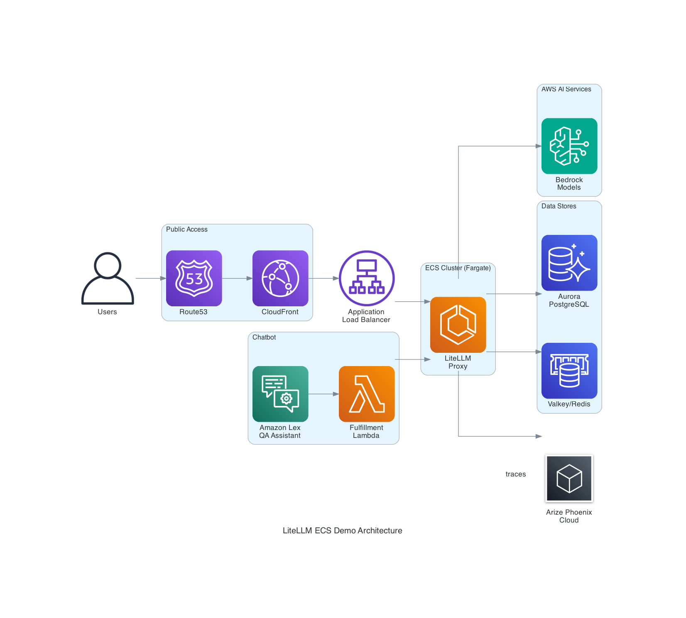

# Building a Production-Ready LLM Gateway with Observability on AWS

*How to deploy LiteLLM proxy with Arize Phoenix observability, Amazon Lex chatbot, and AWS Bedrock guardrails using Terraform*

## Introduction

As organizations adopt Large Language Models (LLMs) for production workloads, they face common challenges: managing multiple model providers, controlling costs, ensuring content safety, and gaining visibility into model performance. This blog post demonstrates how to build a comprehensive LLM gateway on AWS that addresses all these concerns.

We'll deploy:
- **LiteLLM** as a unified API proxy with intelligent routing
- **Arize Phoenix Cloud** for LLM observability and evaluation
- **Amazon Lex** as a conversational interface
- **AWS Bedrock** with guardrails for safe, managed LLM access

## Architecture Overview



The architecture follows AWS best practices for security, scalability, and cost optimization:

1. **Public Access Layer**: CloudFront CDN with Route53 DNS provides HTTPS termination and edge caching
2. **Application Layer**: ECS Fargate runs LiteLLM container with auto-scaling
3. **AI Services**: Amazon Lex chatbot with Lambda fulfillment connects to LiteLLM
4. **Backend Services**: Aurora PostgreSQL and Valkey/Redis provide persistence and caching
5. **Observability**: Arize Phoenix Cloud receives traces for LLM monitoring
6. **Security**: Bedrock Guardrails enforce content policies and PII protection

## Why This Architecture?

### Unified LLM Access with LiteLLM

LiteLLM provides a single OpenAI-compatible API for multiple LLM providers. Key benefits:

- **Cost-based routing**: Automatically select the cheapest model that meets requirements
- **Fallback handling**: Retry failed requests on alternative models
- **Rate limiting**: Protect against runaway costs
- **Standardized API**: Same interface regardless of underlying provider

```yaml
# config.yaml - Cost-based routing across Bedrock models
model_list:
  - model_name: claude-3-sonnet
    litellm_params:
      model: bedrock/anthropic.claude-3-sonnet-20240229-v1:0
  - model_name: claude-3-haiku
    litellm_params:
      model: bedrock/anthropic.claude-3-haiku-20240307-v1:0
  - model_name: titan-text
    litellm_params:
      model: bedrock/amazon.titan-text-express-v1

router_settings:
  routing_strategy: "cost-based-routing"
  num_retries: 3
```

### LLM Observability with Arize Phoenix Cloud

Understanding LLM behavior in production requires specialized tooling. Arize Phoenix Cloud provides:

- **Request tracing**: Full visibility into prompts, completions, and latency
- **Cost tracking**: Token usage and cost per request
- **Evaluation**: Compare model outputs against ground truth
- **Debugging**: Identify problematic prompts and responses

LiteLLM sends traces to Phoenix Cloud via the arize_phoenix callback. Simply configure your Phoenix API key:

```yaml
litellm_settings:
  callbacks: ["arize_phoenix"]

# Set PHOENIX_API_KEY environment variable for cloud authentication
environment_variables:
  PHOENIX_PROJECT_NAME: "litellm-demo"
```

### Content Safety with Bedrock Guardrails

AWS Bedrock Guardrails provide enterprise-grade content filtering:

```hcl
resource "aws_bedrock_guardrail" "content_filter" {
  name = "litellm-content-filter"
  
  content_policy_config {
    filters_config {
      type            = "HATE"
      input_strength  = "HIGH"
      output_strength = "HIGH"
    }
    filters_config {
      type            = "VIOLENCE"
      input_strength  = "HIGH"
      output_strength = "HIGH"
    }
  }
  
  sensitive_information_policy_config {
    pii_entities_config {
      type   = "EMAIL"
      action = "ANONYMIZE"
    }
    pii_entities_config {
      type   = "PHONE"
      action = "ANONYMIZE"
    }
  }
}
```

### Conversational Interface with Amazon Lex

Amazon Lex provides a managed chatbot that integrates with the LLM gateway:

```hcl
resource "aws_lexv2models_bot" "qa_assistant" {
  name        = "QAAssistant"
  description = "General Q&A chatbot powered by LiteLLM"
  
  data_privacy {
    child_directed = false
  }
  
  idle_session_ttl_in_seconds = 300
}
```

The Lambda fulfillment function forwards queries to LiteLLM:

```python
def lambda_handler(event, context):
    user_message = event.get('inputTranscript', '')
    
    response = http.request(
        'POST',
        f"{LITELLM_ENDPOINT}/chat/completions",
        body=json.dumps({
            'model': 'claude-3-sonnet',
            'messages': [{'role': 'user', 'content': user_message}]
        })
    )
    
    result = json.loads(response.data)
    return build_lex_response(result['choices'][0]['message']['content'])
```

## Deployment Guide

### Prerequisites

- AWS Account with Bedrock model access enabled
- Terraform >= 1.0
- Docker for container builds
- Private CA for TLS certificates

### Step 1: Build the LiteLLM Container

```bash
# Build base image with dependencies
docker build -f Dockerfile.base -t litellm-base .

# Push to ECR
aws ecr get-login-password --region us-east-1 | \
  docker login --username AWS --password-stdin <account>.dkr.ecr.us-east-1.amazonaws.com

docker tag litellm-base:latest <account>.dkr.ecr.us-east-1.amazonaws.com/base_images:litellm_base_image
docker push <account>.dkr.ecr.us-east-1.amazonaws.com/base_images:litellm_base_image
```

### Step 2: Configure Terraform

Create `terraform.tfvars`:

```hcl
env                       = "dev"
project_name              = "litellm-demo"
hosted_zone_name          = "example.com"
subdomain                 = "litellm"
image_uri_litellm         = "<account>.dkr.ecr.us-east-1.amazonaws.com/litellm:latest"
certificate_authority_arn = "arn:aws:acm-pca:us-east-1:xxx"

s3_buckets = {
  lb_access_logs = "my-lb-logs"
  litellm        = "my-litellm-config"
}

# Arize Phoenix Cloud API key (get from https://app.phoenix.arize.com/)
phoenix_api_key = "your-phoenix-api-key"
```

### Step 3: Deploy Infrastructure

```bash
cd terraform
terraform init
terraform plan -out=tfplan
terraform apply tfplan
```

### Step 4: Verify Deployment

Test the LiteLLM API:

```bash
curl -X POST https://litellm.example.com/chat/completions \
  -H "Authorization: Bearer $LITELLM_API_KEY" \
  -H "Content-Type: application/json" \
  -d '{
    "model": "claude-3-sonnet",
    "messages": [{"role": "user", "content": "Hello!"}]
  }'
```

Access Phoenix Cloud at `https://app.phoenix.arize.com/` to view traces.

## Evaluating LLM Quality with SQuAD

Use the Stanford Question Answering Dataset (SQuAD) to evaluate model quality:

```python
from phoenix.client import Client
from datasets import load_dataset

# Load SQuAD validation set
squad = load_dataset("squad", split="validation[:100]")

# Create Phoenix dataset with ground truth
client = Client()
dataset = client.create_dataset(
    name="squad-qa-evaluation",
    description="SQuAD Q&A pairs for LLM evaluation"
)

for item in squad:
    client.add_example(
        dataset_id=dataset.id,
        input={"question": item["question"], "context": item["context"]},
        output={"answer": item["answers"]["text"][0]}
    )
```

Phoenix calculates:
- **Exact Match (EM)**: Percentage of exact answer matches
- **F1 Score**: Token overlap between predicted and ground truth
- **Semantic Similarity**: Embedding-based comparison
- **Latency Distribution**: Response time percentiles

## Cost Optimization

This architecture includes several cost optimization strategies:

1. **Aurora Serverless v2**: Scales to zero during idle periods
2. **Cost-based routing**: LiteLLM selects cheapest capable model
3. **CloudFront caching**: Reduces origin requests for static content
4. **ECS Fargate Spot**: Use Spot capacity for non-production

Estimated monthly costs (us-east-1):
- ECS Fargate: ~$50-100 (depending on traffic)
- Aurora Serverless: ~$30-50 (scales with usage)
- Valkey/Redis: ~$25 (t4g.small)
- CloudFront: ~$10-20 (depending on traffic)
- Bedrock: Pay-per-token (varies by model)

## Security Considerations

- **Network isolation**: Services run in private subnets with VPC endpoints
- **Encryption**: TLS 1.2+ for all traffic, KMS for data at rest
- **Secrets management**: API keys stored in AWS Secrets Manager
- **Content filtering**: Bedrock Guardrails block harmful content
- **PII protection**: Automatic anonymization of sensitive data

## Conclusion

This architecture provides a production-ready foundation for LLM applications on AWS. By combining LiteLLM's routing capabilities with Arize Phoenix Cloud observability and Bedrock's managed models with guardrails, organizations can deploy LLMs with confidence.

Key takeaways:
- **Unified API**: Single interface for multiple LLM providers
- **Cost control**: Intelligent routing and usage tracking
- **Observability**: Full visibility into LLM behavior via Phoenix Cloud
- **Safety**: Content filtering and PII protection built-in
- **Scalability**: Serverless components scale automatically

## Resources

- [LiteLLM Documentation](https://docs.litellm.ai/)
- [Arize Phoenix](https://phoenix.arize.com/)
- [Amazon Bedrock](https://aws.amazon.com/bedrock/)
- [Amazon Lex](https://aws.amazon.com/lex/)
- [Terraform AWS Provider](https://registry.terraform.io/providers/hashicorp/aws/latest)

---

*This blog post accompanies the LiteLLM ECS Demo repository. See the README for detailed setup instructions.*
