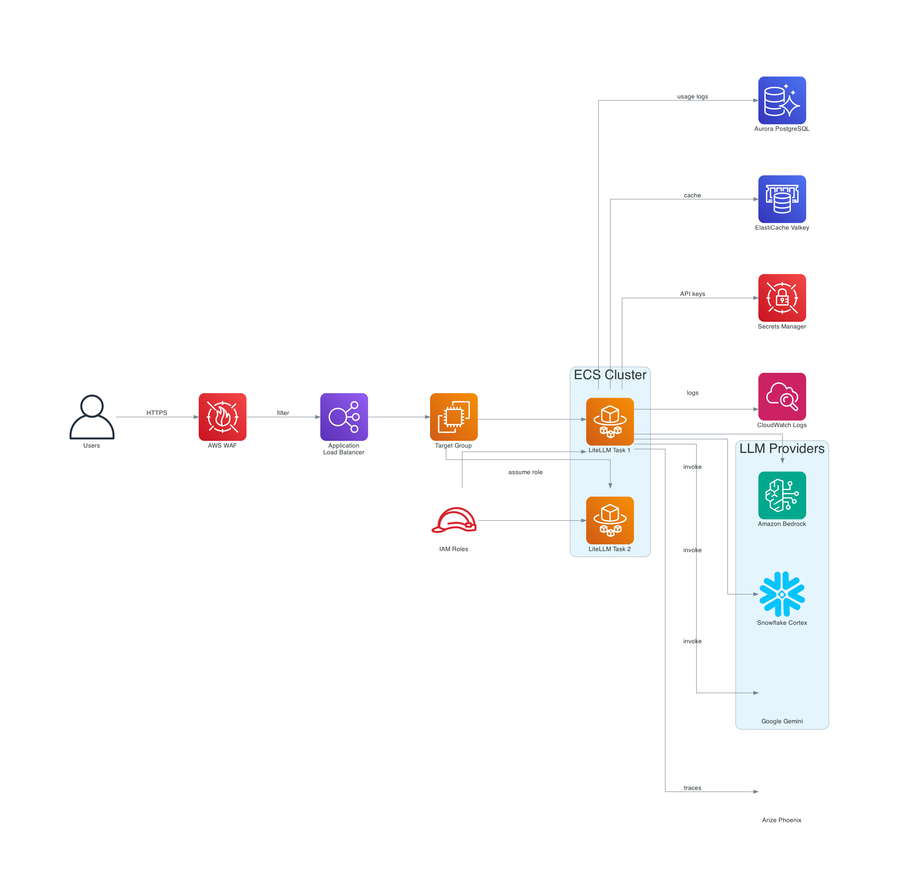

# Building an Enterprise LLM Gateway with LiteLLM, Amazon Bedrock, and Observability

Managing Large Language Model (LLM) deployments in enterprise environments presents unique challenges. Development teams often start with a single model for a proof-of-concept, but as adoption grows, they face requests from multiple business units wanting different models, finance teams demanding cost tracking, security requiring content filtering, and operations needing visibility into model performance. Without a unified approach, organizations end up with fragmented implementations, inconsistent security controls, and limited visibility into how models are actually being used.

In this post, I walk through building an enterprise LLM gateway using LiteLLM on Amazon ECS, with Amazon Bedrock for model access, Bedrock Guardrails for content safety, and Arize Phoenix for observability. The solution provides a unified OpenAI-compatible API that abstracts away the complexity of multi-model management while maintaining enterprise-grade security and monitoring.

## Solution Overview

The LLM gateway architecture provides a centralized service that sits between applications and the underlying foundation models. Applications interact with a single, consistent API regardless of which model they're using—whether that's Amazon Nova Pro, Titan Text, or Claude. The gateway handles model routing, observability instrumentation, and integrates with AWS security services.



The architecture includes several key components working together:

- **Amazon Lex** provides a conversational interface for end users, with Lambda fulfillment routing queries to the LiteLLM gateway
- **AWS WAF** protects the gateway with IP whitelisting, rate limiting, and AWS managed rules for DDoS protection
- **Application Load Balancer** distributes traffic to ECS tasks with health checking and TLS termination
- **ECS Fargate** runs the LiteLLM container in a serverless compute environment
- **Aurora PostgreSQL Serverless v2** stores API keys, usage tracking, and audit logs with automatic scaling
- **ElastiCache Valkey** provides high-performance caching for rate limiting and session state
- **Amazon Bedrock** hosts foundation models with Guardrails for content safety
- **Arize Phoenix** delivers LLM-specific observability with tracing, metrics, and evaluation capabilities

## Prerequisites

Before deploying this solution, ensure you have the following in place:

- An AWS account with Amazon Bedrock access enabled in your target region
- Model access approved for Amazon Nova Pro and Amazon Titan Text Express in the Bedrock console
- Terraform version 1.5 or later installed on your local machine
- Docker installed for building the LiteLLM container image
- AWS CLI configured with credentials that have permissions to create ECS clusters, Aurora databases, ElastiCache clusters, and associated IAM roles
- An Arize Phoenix account for observability (free tier available at phoenix.arize.com)

## Setting Up the LiteLLM Configuration

LiteLLM is an open-source proxy that provides an OpenAI-compatible API interface to over 100 LLM providers, including Amazon Bedrock. The key benefit is that applications can switch between models without code changes—just update the model name in the request.

The configuration file defines which models are available through the gateway, how requests should be routed, and what callbacks should be invoked for observability. Create a `config.yaml` file with the following content:

```yaml
model_list:
  - model_name: titan-text
    litellm_params:
      model: bedrock/amazon.titan-text-express-v1
      aws_region_name: us-east-1
  - model_name: nova-pro
    litellm_params:
      model: bedrock/us.amazon.nova-pro-v1:0
      aws_region_name: us-east-1

litellm_settings:
  callbacks: ["arize_phoenix"]

guardrails:
  - guardrail_name: "bedrock-content-filter"
    litellm_params:
      guardrail: bedrock
      mode: "during_call"
      guardrailIdentifier: os.environ/GUARDRAIL_ID
      guardrailVersion: os.environ/GUARDRAIL_VERSION

router_settings:
  routing_strategy: "cost-based-routing"
  num_retries: 3
  timeout: 60

general_settings:
  proxy_batch_write_at: 60
  database_connection_pool_limit: 10
  allow_requests_on_db_unavailable: True

environment_variables:
  PHOENIX_API_KEY: os.environ/PHOENIX_AP_KEY
  PHOENIX_COLLECTOR_ENDPOINT: os.environ/PHOENIX_COLLECTOR_ENDPOINT
  PHOENIX_PROJECT_NAME: os.environ/PHOENIX_PROJECT_NAME
```

The `model_list` defines which models are available through the gateway. Each model gets a friendly name that applications use (like `nova-pro`), while `litellm_params` specifies the actual provider and model identifier. The `bedrock/` prefix tells LiteLLM to use the Amazon Bedrock provider.

The `router_settings` configure intelligent routing. With `cost-based-routing`, LiteLLM automatically selects the least expensive model that can handle each request when multiple models are available. The `num_retries` setting ensures resilience—if a model call fails, the gateway retries before returning an error.

The `guardrails` section integrates Amazon Bedrock Guardrails directly into the request flow. The `during_call` mode applies the guardrail as part of the model invocation, filtering both inputs and outputs according to your configured policies.

## Building the Docker Image

LiteLLM provides official Docker images that we can extend with our configuration. Create a `Dockerfile.litellm` that copies your configuration into the container:

```dockerfile
# Use the provided base image
FROM docker.litellm.ai/berriai/litellm:main-stable

# Set the working directory to /app
WORKDIR /app

# Copy the configuration file into the container at /app
COPY config.yaml .

# Make sure your docker/entrypoint.sh is executable
RUN chmod +x ./docker/entrypoint.sh

# Expose the necessary port
EXPOSE 4000/tcp

CMD ["--port", "4000", "--config", "config.yaml", "--detailed_debug"]
```

The base image includes all LiteLLM dependencies and the proxy server. We simply add our configuration file and specify the startup command. The `--detailed_debug` flag provides verbose logging during development—you can remove this for production deployments.

## Deploying the Infrastructure with Terraform

The Terraform configuration creates all the AWS resources needed to run the gateway. Let's walk through each component.

### Secrets Management

All sensitive values are stored in AWS Secrets Manager. The LiteLLM master key and salt key are auto-generated with the `sk-` prefix that LiteLLM expects:

```hcl
resource "random_password" "litellm_master" {
  length  = 21
  special = false
}

resource "random_password" "litellm_salt" {
  length  = 21
  special = false
}

resource "aws_secretsmanager_secret" "litellm_master_salt" {
  name_prefix             = "${var.project_name}-master-salt-"
  recovery_window_in_days = 0
}

resource "aws_secretsmanager_secret_version" "litellm_master_salt" {
  secret_id = aws_secretsmanager_secret.litellm_master_salt.id
  secret_string = jsonencode({
    LITELLM_MASTER_KEY = "sk-${random_password.litellm_master.result}"
    LITELLM_SALT_KEY   = "sk-${random_password.litellm_salt.result}"
  })
}
```

The master key authenticates API requests to the gateway. The salt key is used for hashing sensitive data. By generating these automatically and storing them in Secrets Manager, we avoid hardcoding credentials and enable secret rotation without redeployment.

### Aurora PostgreSQL Serverless v2

LiteLLM uses a PostgreSQL database to store API keys, usage tracking, rate limiting state, and audit logs. Aurora Serverless v2 provides automatic scaling based on actual database load:

```hcl
module "aurora_db" {
  source            = "git::https://github.com/terraform-aws-modules/terraform-aws-rds-aurora.git"
  name              = "${var.project_name}-aurora-postgresql"
  engine            = "aurora-postgresql"
  engine_mode       = "provisioned"
  instances         = local.serverless_instances
  storage_encrypted = true
  master_username   = "postgres"

  vpc_id               = data.aws_vpc.main.id
  db_subnet_group_name = aws_db_subnet_group.aurora.name

  manage_master_user_password        = false
  master_password_wo                 = random_password.aurora_password.result
  serverlessv2_scaling_configuration = {
    min_capacity = 0.5
    max_capacity = 2
  }
}
```

The serverless configuration scales capacity in fine-grained increments. During periods of low activity, it scales down to 0.5 ACU (Aurora Capacity Units), minimizing costs. When traffic increases, it scales up automatically—no manual intervention required. For a development or low-traffic deployment, this approach significantly reduces costs compared to provisioned database instances.

### ElastiCache Valkey

Valkey (a Redis-compatible cache) serves multiple purposes: rate limiting, session state management, and response caching. The configuration enables encryption and authentication:

```hcl
module "elasticache" {
  source         = "git::https://github.com/terraform-aws-modules/terraform-aws-elasticache.git"
  engine         = "valkey"
  engine_version = "7.2"
  node_type      = "cache.t4g.small"

  multi_az_enabled           = true
  num_cache_clusters         = 2
  automatic_failover_enabled = true

  transit_encryption_enabled = true
  auth_token                 = random_password.redis_password.result
  at_rest_encryption_enabled = true

  vpc_id     = data.aws_vpc.main.id
  subnet_ids = local.database_subnet_ids
}
```

Multi-AZ deployment ensures the cache remains available even if an Availability Zone experiences issues. Transit encryption (TLS) protects data in motion, while at-rest encryption protects stored data.

### AWS WAF Configuration

AWS WAF provides multiple layers of protection for the gateway. The configuration implements IP whitelisting as the primary access control, with rate limiting and managed rules as additional defenses:

```hcl
resource "aws_wafv2_ip_set" "whitelist" {
  name               = "${var.project_name}-ip-whitelist"
  description        = "Whitelisted IP addresses"
  scope              = "REGIONAL"
  ip_address_version = "IPV4"
  addresses          = var.waf_whitelisted_ips
}

resource "aws_wafv2_web_acl" "litellm" {
  name        = "${var.project_name}-waf"
  description = "WAF for LiteLLM ALB with IP whitelist and DDoS protection"
  scope       = "REGIONAL"

  default_action {
    block {}
  }

  # Priority 0: Allow whitelisted IPs
  rule {
    name     = "AllowWhitelistedIPs"
    priority = 0

    action {
      allow {}
    }

    statement {
      ip_set_reference_statement {
        arn = aws_wafv2_ip_set.whitelist.arn
      }
    }
  }

  # Priority 1: Rate-based rule for DDoS protection
  rule {
    name     = "RateLimitRule"
    priority = 1

    action {
      block {}
    }

    statement {
      rate_based_statement {
        limit              = var.waf_rate_limit
        aggregate_key_type = "IP"
      }
    }
  }
}
```

The default action is `block`, meaning any request that doesn't match an allow rule is rejected. The IP whitelist rule has the highest priority (0), allowing traffic from known IP addresses. The rate limit rule (priority 1) blocks IPs that exceed the configured request threshold within a 5-minute window.

The WAF also includes AWS managed rule groups that protect against common attack patterns:

- **AWSManagedRulesCommonRuleSet**: Blocks SQL injection, cross-site scripting, and other common exploits
- **AWSManagedRulesKnownBadInputsRuleSet**: Blocks requests with known malicious patterns
- **AWSManagedRulesAmazonIpReputationList**: Blocks requests from IP addresses with poor reputation
- **AWSManagedRulesAnonymousIpList**: Blocks requests from VPNs, proxies, and Tor exit nodes

### Amazon Bedrock Guardrails

Bedrock Guardrails provide content filtering at the model layer. The configuration blocks harmful content categories and automatically anonymizes PII in responses:

```hcl
resource "aws_bedrock_guardrail" "content_filter" {
  name                      = "litellm-content-filter"
  blocked_input_messaging   = "I cannot process this request as it contains content that violates our usage policies."
  blocked_outputs_messaging = "I cannot provide this response as it would violate our content policies."

  content_policy_config {
    filters_config {
      type            = "HATE"
      input_strength  = "HIGH"
      output_strength = "HIGH"
    }
    filters_config {
      type            = "VIOLENCE"
      input_strength  = "HIGH"
      output_strength = "HIGH"
    }
    filters_config {
      type            = "SEXUAL"
      input_strength  = "HIGH"
      output_strength = "HIGH"
    }
    filters_config {
      type            = "PROMPT_ATTACK"
      input_strength  = "HIGH"
      output_strength = "NONE"
    }
  }

  sensitive_information_policy_config {
    pii_entities_config {
      type   = "EMAIL"
      action = "ANONYMIZE"
    }
    pii_entities_config {
      type   = "PHONE"
      action = "ANONYMIZE"
    }
  }
}
```

The `PROMPT_ATTACK` filter specifically targets jailbreak attempts and prompt injection attacks. This is crucial for production deployments where malicious users might try to manipulate the model into bypassing its safety guidelines.

PII protection automatically detects and anonymizes email addresses and phone numbers in model outputs. This protection operates transparently—your application code doesn't need to implement PII detection.

### ECS Task Definition

The ECS task definition specifies how the LiteLLM container should run. Sensitive values are injected from Secrets Manager at runtime:

```hcl
resource "aws_ecs_task_definition" "litellm" {
  family                   = "${var.project_name}-task"
  requires_compatibilities = ["FARGATE"]
  network_mode             = "awsvpc"
  cpu                      = 1024
  memory                   = 2048
  execution_role_arn       = aws_iam_role.ecs_task_execution.arn
  task_role_arn            = aws_iam_role.ecs_task.arn

  container_definitions = jsonencode([
    {
      name      = "litellm"
      image     = "${aws_ecr_repository.litellm.repository_url}:latest"
      essential = true

      environment = [
        { name = "AWS_REGION", value = data.aws_region.current.name },
        { name = "REDIS_HOST", value = module.elasticache.replication_group_primary_endpoint_address },
        { name = "GUARDRAIL_ID", value = aws_bedrock_guardrail.content_filter.guardrail_id },
        { name = "GUARDRAIL_VERSION", value = aws_bedrock_guardrail_version.content_filter.version },
        { name = "PHOENIX_PROJECT_NAME", value = var.phoenix_project_name },
        { name = "PHOENIX_COLLECTOR_ENDPOINT", value = var.phoenix_collector_endpoint }
      ]

      secrets = [
        {
          name      = "LITELLM_MASTER_KEY"
          valueFrom = "${aws_secretsmanager_secret.litellm_master_salt.arn}:LITELLM_MASTER_KEY::"
        },
        {
          name      = "DATABASE_URL"
          valueFrom = aws_secretsmanager_secret.litellm_db_url.arn
        },
        {
          name      = "PHOENIX_AP_KEY"
          valueFrom = aws_secretsmanager_secret.phoenix_api_key.arn
        }
      ]

      portMappings = [{
        containerPort = 4000
        hostPort      = 4000
        protocol      = "tcp"
      }]
    }
  ])
}
```

The task uses Fargate launch type, which eliminates the need to provision or manage EC2 instances. You define the CPU and memory requirements, and AWS handles the underlying infrastructure.

The `secrets` block references Secrets Manager ARNs. ECS retrieves these values at task startup and injects them as environment variables. This approach keeps credentials out of container images and enables rotation without redeployment.

### Automated Docker Build and Push

The Terraform configuration includes automation for building and pushing the Docker image whenever the configuration changes:

```hcl
resource "null_resource" "docker_build_push" {
  triggers = {
    config_hash     = filemd5("${path.module}/../config.yaml")
    dockerfile_hash = filemd5("${path.module}/../Dockerfile.litellm")
  }

  provisioner "local-exec" {
    working_dir = "${path.module}/.."
    command     = <<-EOT
      aws ecr get-login-password --region ${data.aws_region.current.name} | docker login --username AWS --password-stdin ${data.aws_caller_identity.current.account_id}.dkr.ecr.${data.aws_region.current.name}.amazonaws.com
      docker build -f Dockerfile.litellm -t ${aws_ecr_repository.litellm.repository_url}:latest .
      docker push ${aws_ecr_repository.litellm.repository_url}:latest
    EOT
  }

  depends_on = [aws_ecr_repository.litellm]
}
```

The `triggers` block watches for changes to the config file or Dockerfile. When either changes, Terraform rebuilds and pushes the image. The ECS service is configured with `force_new_deployment = true` and depends on this resource, ensuring infrastructure changes flow through to running containers automatically.

## Adding a Conversational Interface with Amazon Lex

While the LiteLLM gateway provides an API for programmatic access, many use cases benefit from a conversational interface. Amazon Lex provides a managed chatbot service that integrates with the gateway through Lambda fulfillment.

The Lex bot implements three intents:

```hcl
resource "aws_lexv2models_intent" "greeting_intent" {
  bot_id      = aws_lexv2models_bot.qa_assistant.id
  bot_version = aws_lexv2models_bot_locale.en_us.bot_version
  locale_id   = aws_lexv2models_bot_locale.en_us.locale_id
  name        = "GreetingIntent"

  sample_utterance { utterance = "hi" }
  sample_utterance { utterance = "hello" }
  sample_utterance { utterance = "hey" }

  fulfillment_code_hook {
    enabled = true
  }
}

resource "aws_lexv2models_intent" "qa_intent" {
  name        = "QAIntent"
  description = "Intent that forwards queries to LiteLLM"

  sample_utterance { utterance = "I have a question" }
  sample_utterance { utterance = "help me with something" }
  sample_utterance { utterance = "what is this" }

  fulfillment_code_hook {
    enabled = true
  }
}

resource "aws_lexv2models_intent" "closing_intent" {
  name        = "ClosingIntent"

  sample_utterance { utterance = "bye" }
  sample_utterance { utterance = "goodbye" }
  sample_utterance { utterance = "thanks" }

  fulfillment_code_hook {
    enabled = true
  }
}
```

The Lambda fulfillment function handles all intents, routing questions to LiteLLM and returning appropriate responses:

```python
def lambda_handler(event, context):
    intent_name = event.get('sessionState', {}).get('intent', {}).get('name', 'FallbackIntent')
    user_message = event.get('inputTranscript', '')
    
    if intent_name == 'GreetingIntent':
        return build_response(
            intent_name=intent_name,
            message="Hello! I'm your Q&A assistant powered by AWS Bedrock. How can I help you today?"
        )
    elif intent_name == 'ClosingIntent':
        return build_response(
            intent_name=intent_name,
            message="Goodbye! It was great chatting with you. Have a wonderful day!"
        )
    elif intent_name == 'QAIntent':
        assistant_message = call_litellm(user_message)
        return build_response(intent_name=intent_name, message=assistant_message)


def call_litellm(user_message: str) -> str:
    api_key = get_litellm_api_key()  # Retrieved from Secrets Manager
    
    payload = {
        'model': 'nova-pro',
        'messages': [
            {'role': 'system', 'content': 'You are a helpful Q&A assistant.'},
            {'role': 'user', 'content': user_message}
        ],
        'max_tokens': 500
    }
    
    response = http.request(
        'POST',
        f"{LITELLM_ENDPOINT}/v1/chat/completions",
        headers={'Authorization': f'Bearer {api_key}', 'Content-Type': 'application/json'},
        body=json.dumps(payload)
    )
    
    result = json.loads(response.data)
    return result['choices'][0]['message']['content']
```

The Lambda function retrieves the LiteLLM API key from Secrets Manager and communicates with the gateway over HTTPS. This design keeps credentials secure while enabling the conversational interface.

## Deploying the Solution

With all the configuration in place, deploy the infrastructure:

```bash
cd terraform

# Initialize Terraform and download providers
terraform init

# Review the planned changes
terraform plan

# Apply the configuration
terraform apply
```

The deployment creates all resources including the ECR repository, builds and pushes the Docker image, and starts the ECS service. The entire process takes approximately 10-15 minutes, with most of the time spent provisioning Aurora and ElastiCache.

Once deployed, retrieve the ALB DNS name from the Terraform outputs:

```bash
terraform output alb_dns_name
```

## Testing the Gateway

Test the gateway health endpoint:

```bash
curl -sk https://<alb-dns-name>/health/liveliness
# Returns: "I'm alive!"
```

Make a chat completion request using your LiteLLM API key:

```bash
curl -sk https://<alb-dns-name>/v1/chat/completions \
  -H "Content-Type: application/json" \
  -H "Authorization: Bearer <your-api-key>" \
  -d '{
    "model": "nova-pro",
    "messages": [{"role": "user", "content": "What is Amazon Bedrock?"}]
  }'
```

The gateway also exposes a Swagger UI at `/ui` where you can explore the API and test requests interactively.

## Monitoring with Arize Phoenix

With the Phoenix callback configured, every request through the gateway generates a trace. Navigate to your Phoenix project to see:

- **Request traces**: Complete interaction details including prompts, responses, and timing
- **Token usage**: Input and output token counts per request
- **Latency breakdown**: Time spent in each phase of the request
- **Cost tracking**: Estimated cost per request based on model pricing

Phoenix enables you to debug issues by searching traces, identify performance bottlenecks, and track quality metrics over time. When a user reports an unexpected response, you can find the exact trace and understand what happened.

## Conclusion

Building production LLM systems requires more than model access. Organizations need unified interfaces across providers, deep observability into model behavior, and robust safety controls. The architecture presented here addresses these requirements through a combination of open-source tooling and managed AWS services.

LiteLLM provides the gateway abstraction, offering a consistent API regardless of underlying model provider. Arize Phoenix delivers the observability depth that LLM operations demand. Amazon Bedrock Guardrails enforce content safety at the model layer. AWS WAF provides network-level protection. Together, these components create a foundation for enterprise LLM deployments that scales with your organization's needs.

The complete Terraform configuration is available in this repository. To deploy:

1. Clone the repository and navigate to the `chatbot_litellm/terraform` directory
2. Update `terraform.tfvars` with your IP address and Phoenix API key
3. Run `terraform init` and `terraform apply`
4. Test the endpoint at the ALB DNS name from the outputs

---

*The code for this architecture is available in the [chatbot_litellm](.) directory.*
