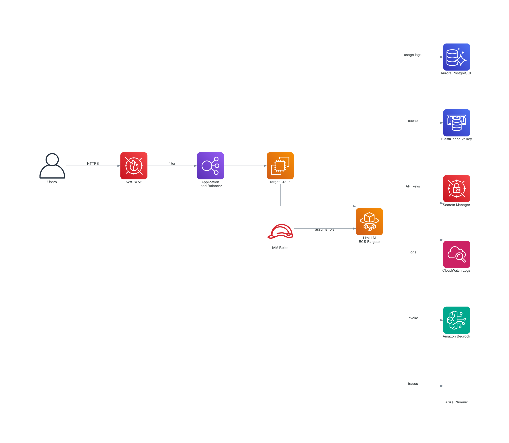

# Building an Enterprise LLM Gateway with LiteLLM on AWS

## Introduction

Managing Large Language Model (LLM) deployments in enterprise environments presents unique challenges. Development teams often start with a single model for a proof-of-concept, but as adoption grows, they face requests from multiple business units wanting different models, finance teams demanding cost tracking, security requiring content filtering, and operations needing visibility into model performance. Without a unified approach, organizations end up with fragmented implementations, inconsistent security controls, and limited visibility into how models are actually being used.

This post walks through building an enterprise LLM gateway using LiteLLM on Amazon ECS, with Amazon Bedrock for model access, Bedrock Guardrails for content safety, and Arize Phoenix for observability. The solution provides a unified OpenAI-compatible API that abstracts away the complexity of multi-model management while maintaining enterprise-grade security and monitoring.

The use case that motivated this work involved providing a centralized gateway for multiple teams to access foundation models. Each team has different requirements—some need cost-optimized models for high-volume tasks, others need the most capable models for complex reasoning. The goal was to provide a single API endpoint that handles model routing, enforces content policies, tracks usage, and provides deep observability into every request.

## Architecture Overview

The architecture leverages several AWS services working together. LiteLLM runs on ECS Fargate as the central proxy, providing an OpenAI-compatible API. Amazon Bedrock hosts the foundation models. Aurora PostgreSQL stores API keys and usage data. ElastiCache Valkey handles caching and rate limiting. AWS WAF protects the endpoint. Arize Phoenix provides LLM-specific observability.



The infrastructure is defined entirely in Terraform, enabling consistent deployments across accounts and regions. The deployment process builds a custom Docker image, pushes it to ECR, and provisions all supporting infrastructure automatically.

## Prerequisites

Before deploying, ensure you have:

- An AWS account with Amazon Bedrock access enabled
- Model access approved for Amazon Nova Pro and Amazon Titan Text Express in the Bedrock console
- Terraform 1.5+ installed
- Docker installed for building the container image
- AWS CLI configured with appropriate permissions
- An Arize Phoenix account (free tier available at phoenix.arize.com)

## Deploying the Infrastructure

Clone the repository and navigate to the terraform directory:

```bash
git clone <repository-url>
cd chatbot_litellm/terraform
```

Create a `terraform.tfvars` file with your configuration:

```hcl
project_name           = "litellm-demo"
env                    = "dev"
waf_whitelisted_ips    = ["YOUR_IP/32"]
phoenix_api_key        = "your-phoenix-api-key"
phoenix_collector_endpoint = "https://app.phoenix.arize.com/v1/traces"
phoenix_project_name   = "litellm-gateway"
litellm_api_key        = "sk-your-api-key"
```

Initialize and apply the Terraform configuration:

```bash
terraform init
terraform plan
terraform apply
```

The deployment takes approximately 10-15 minutes, with most time spent provisioning Aurora and ElastiCache. You can monitor progress in the AWS Console under CloudFormation or by watching the Terraform output.

Once complete, note the ALB DNS name from the outputs:

```bash
terraform output alb_dns_name
```

## Understanding the LiteLLM Configuration

LiteLLM is an open-source proxy that provides an OpenAI-compatible API interface to over 100 LLM providers, including Amazon Bedrock. The key benefit is that applications can switch between models without code changes—just update the model name in the request.

The configuration file (`config.yaml`) defines which models are available:

```yaml
model_list:
  - model_name: titan-text
    litellm_params:
      model: bedrock/amazon.titan-text-express-v1
      aws_region_name: us-east-1
  - model_name: nova-pro
    litellm_params:
      model: bedrock/us.amazon.nova-pro-v1:0
      aws_region_name: us-east-1

litellm_settings:
  callbacks: ["arize_phoenix"]

guardrails:
  - guardrail_name: "bedrock-content-filter"
    litellm_params:
      guardrail: bedrock
      mode: "during_call"
      guardrailIdentifier: os.environ/GUARDRAIL_ID
      guardrailVersion: os.environ/GUARDRAIL_VERSION

router_settings:
  routing_strategy: "cost-based-routing"
  num_retries: 3
  timeout: 60
```

Each model gets a friendly name (like `nova-pro`) that applications use, while `litellm_params` specifies the actual provider and model identifier. The `bedrock/` prefix tells LiteLLM to use the Amazon Bedrock provider.

The `router_settings` configure intelligent routing. With `cost-based-routing`, LiteLLM automatically selects the least expensive model when multiple models are available. The `num_retries` setting ensures resilience—if a model call fails, the gateway retries before returning an error.

## Understanding the Infrastructure Components

### Secrets Management with AWS Secrets Manager

All sensitive values are stored in AWS Secrets Manager. The Terraform configuration auto-generates the LiteLLM master key and salt key with the `sk-` prefix that LiteLLM expects:

```hcl
resource "random_password" "litellm_master" {
  length  = 21
  special = false
}

resource "aws_secretsmanager_secret_version" "litellm_master_salt" {
  secret_id = aws_secretsmanager_secret.litellm_master_salt.id
  secret_string = jsonencode({
    LITELLM_MASTER_KEY = "sk-${random_password.litellm_master.result}"
    LITELLM_SALT_KEY   = "sk-${random_password.litellm_salt.result}"
  })
}
```

The master key authenticates API requests to the gateway. By generating these automatically and storing them in Secrets Manager, we avoid hardcoding credentials and enable secret rotation without redeployment.

### Aurora PostgreSQL Serverless v2

LiteLLM uses PostgreSQL to store API keys, usage tracking, rate limiting state, and audit logs. Aurora Serverless v2 provides automatic scaling based on actual database load:

```hcl
module "aurora_db" {
  source            = "git::https://github.com/terraform-aws-modules/terraform-aws-rds-aurora.git"
  name              = "${var.project_name}-aurora-postgresql"
  engine            = "aurora-postgresql"
  engine_mode       = "provisioned"
  
  serverlessv2_scaling_configuration = {
    min_capacity = 0.5
    max_capacity = 2
  }
}
```

The serverless configuration scales capacity in fine-grained increments. During periods of low activity, it scales down to 0.5 ACU (Aurora Capacity Units), minimizing costs. When traffic increases, it scales up automatically.

### ElastiCache Valkey for Caching

Valkey (a Redis-compatible cache) serves multiple purposes: rate limiting, session state management, and response caching:

```hcl
module "elasticache" {
  source         = "git::https://github.com/terraform-aws-modules/terraform-aws-elasticache.git"
  engine         = "valkey"
  engine_version = "7.2"
  node_type      = "cache.t4g.small"

  multi_az_enabled           = true
  transit_encryption_enabled = true
  auth_token                 = random_password.redis_password.result
}
```

Multi-AZ deployment ensures the cache remains available even if an Availability Zone experiences issues. Transit encryption (TLS) protects data in motion.

### AWS WAF for Security

AWS WAF provides multiple layers of protection. The configuration implements IP whitelisting as the primary access control, with rate limiting and managed rules as additional defenses:

```hcl
resource "aws_wafv2_web_acl" "litellm" {
  name        = "${var.project_name}-waf"
  scope       = "REGIONAL"

  default_action {
    block {}
  }

  rule {
    name     = "AllowWhitelistedIPs"
    priority = 0
    action { allow {} }
    statement {
      ip_set_reference_statement {
        arn = aws_wafv2_ip_set.whitelist.arn
      }
    }
  }

  rule {
    name     = "RateLimitRule"
    priority = 1
    action { block {} }
    statement {
      rate_based_statement {
        limit              = var.waf_rate_limit
        aggregate_key_type = "IP"
      }
    }
  }
}
```

The default action is `block`, meaning any request that doesn't match an allow rule is rejected. The WAF also includes AWS managed rule groups that protect against SQL injection, cross-site scripting, and requests from known malicious IPs.

### Amazon Bedrock Guardrails

Bedrock Guardrails provide content filtering at the model layer. The configuration blocks harmful content categories and automatically anonymizes PII:

```hcl
resource "aws_bedrock_guardrail" "content_filter" {
  name = "litellm-content-filter"
  
  content_policy_config {
    filters_config {
      type            = "HATE"
      input_strength  = "HIGH"
      output_strength = "HIGH"
    }
    filters_config {
      type            = "PROMPT_ATTACK"
      input_strength  = "HIGH"
      output_strength = "NONE"
    }
  }

  sensitive_information_policy_config {
    pii_entities_config {
      type   = "EMAIL"
      action = "ANONYMIZE"
    }
  }
}
```

The `PROMPT_ATTACK` filter specifically targets jailbreak attempts and prompt injection attacks. PII protection automatically detects and anonymizes email addresses and phone numbers in model outputs.

### ECS Fargate for Compute

The ECS task definition specifies how the LiteLLM container runs. Sensitive values are injected from Secrets Manager at runtime:

```hcl
resource "aws_ecs_task_definition" "litellm" {
  family                   = "${var.project_name}-task"
  requires_compatibilities = ["FARGATE"]
  network_mode             = "awsvpc"
  cpu                      = 1024
  memory                   = 2048

  container_definitions = jsonencode([{
    name  = "litellm"
    image = "${aws_ecr_repository.litellm.repository_url}:latest"
    
    secrets = [
      {
        name      = "LITELLM_MASTER_KEY"
        valueFrom = "${aws_secretsmanager_secret.litellm_master_salt.arn}:LITELLM_MASTER_KEY::"
      },
      {
        name      = "DATABASE_URL"
        valueFrom = aws_secretsmanager_secret.litellm_db_url.arn
      }
    ]
  }])
}
```

Fargate eliminates the need to provision or manage EC2 instances. The `secrets` block references Secrets Manager ARNs—ECS retrieves these values at task startup and injects them as environment variables.

## Testing the Gateway

Once deployed, test the health endpoint:

```bash
curl http://<alb-dns-name>/health/liveliness
# Returns: "I'm alive!"
```

Make a chat completion request:

```bash
curl http://<alb-dns-name>/v1/chat/completions \
  -H "Content-Type: application/json" \
  -H "Authorization: Bearer <your-api-key>" \
  -d '{
    "model": "nova-pro",
    "messages": [{"role": "user", "content": "What is Amazon Bedrock?"}]
  }'
```

The gateway also exposes a Swagger UI at `/ui` where you can explore the API interactively.

## Using the OpenAI SDK

Applications can use the standard OpenAI Python SDK by pointing it at the LiteLLM endpoint:

```python
import openai

client = openai.OpenAI(
    api_key="your-litellm-api-key",
    base_url="http://<alb-dns-name>"
)

response = client.chat.completions.create(
    model="nova-pro",
    messages=[{"role": "user", "content": "Explain quantum computing in simple terms"}]
)

print(response.choices[0].message.content)
```

This compatibility means existing applications using OpenAI can switch to Bedrock models with minimal code changes.

## Running Load Tests with Locust

The repository includes a Locust load test script for evaluating gateway performance:

```bash
cd chatbot_litellm/scripts

export LITELLM_API_KEY="your-api-key"
export LITELLM_ENDPOINT="http://<alb-dns-name>"

locust -f locust_load_test.py --host=$LITELLM_ENDPOINT
```

Open `http://localhost:8089` to configure and run the load test. The script sends requests to multiple models and tracks response times, throughput, and error rates.

## Running SQuAD Evaluation with Arize Phoenix

The repository includes an evaluation script that uses the SQuAD dataset to measure model quality:

```bash
cd chatbot_litellm/scripts

export LITELLM_API_KEY="your-api-key"
export LITELLM_ENDPOINT="http://<alb-dns-name>"
export PHOENIX_API_KEY="your-phoenix-api-key"
export NUM_SAMPLES=50

python arize_squad_experiment.py
```

The script:
1. Loads questions from the SQuAD validation dataset
2. Creates a Phoenix dataset with questions, context, and ground truth answers
3. Runs an experiment calling LiteLLM for each question
4. Evaluates responses using exact match and F1 score metrics

Results are visible in the Phoenix UI, where you can compare model performance across different question types.

## Monitoring with Arize Phoenix

With the Phoenix callback configured, every request through the gateway generates a trace. Navigate to your Phoenix project to see:

- **Request traces**: Complete interaction details including prompts, responses, and timing
- **Token usage**: Input and output token counts per request
- **Latency breakdown**: Time spent in each phase of the request
- **Cost tracking**: Estimated cost per request based on model pricing

Phoenix enables you to debug issues by searching traces, identify performance bottlenecks, and track quality metrics over time.

## Viewing Logs in CloudWatch

ECS task logs are available in CloudWatch under the `/ecs/litellm-demo` log group. You can view logs in the AWS Console or query them using CloudWatch Logs Insights:

```
fields @timestamp, @message
| filter @logStream like /litellm/
| sort @timestamp desc
| limit 100
```

## Tearing Down Resources

When you're done experimenting, tear down the infrastructure to avoid ongoing costs:

```bash
cd chatbot_litellm/terraform
terraform destroy
```

This removes all resources including the ECS cluster, Aurora database, ElastiCache cluster, and associated networking components. Note that Aurora and ElastiCache deletion may take several minutes.

## Conclusion

Building production LLM systems requires more than model access. Organizations need unified interfaces across providers, deep observability into model behavior, and robust safety controls. The architecture presented here addresses these requirements through a combination of open-source tooling and managed AWS services.

LiteLLM provides the gateway abstraction, offering a consistent API regardless of underlying model provider. Arize Phoenix delivers the observability depth that LLM operations demand. Amazon Bedrock Guardrails enforce content safety at the model layer. AWS WAF provides network-level protection. Together, these components create a foundation for enterprise LLM deployments that scales with your organization's needs.

---

*The complete code for this architecture is available in the [chatbot_litellm](.) directory.*
