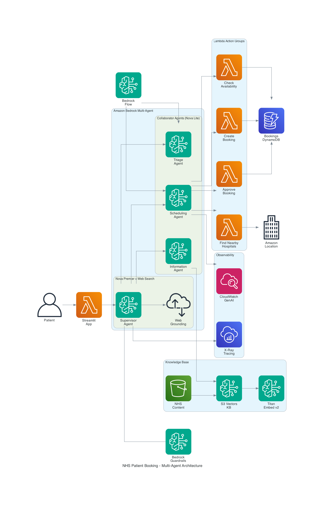

# Building an NHS Patient Booking Assistant with Amazon Bedrock Agents and S3 Vectors

Healthcare appointment booking remains one of the most common friction points in patient experience. In the UK's National Health Service, patients often face long phone queues during peak morning hours, navigate complex online portals with limited appointment visibility, or struggle to find available slots that fit their work schedules and family commitments. A single GP surgery might handle hundreds of booking calls each day, with reception staff spending valuable time on routine administrative tasks that could be automated.

The challenge extends beyond simple scheduling. Patients need to understand which type of appointment suits their needs, whether their concern is urgent enough for same-day access, and what alternatives exist if their preferred GP or time slot is unavailable. Reception staff must triage requests, manage patient expectations, and ensure urgent cases receive priority while routine appointments are scheduled appropriately.

In this post, I walk through building an intelligent patient booking assistant using Amazon Bedrock Agents, Amazon Nova Lite, and the new Amazon S3 Vectors for knowledge base storage. This solution demonstrates how generative AI can handle conversational booking workflows while maintaining appropriate safety guardrails for healthcare scenarios. The assistant not only books appointments but also provides intelligent alternatives when a patient's first choice is unavailable, suggests other consultants or nearby facilities, and ensures patients understand their options.

## Solution Overview

The NHS Patient Booking Assistant provides a conversational interface where patients can describe their booking needs in natural language. Rather than navigating menus or filling forms, patients simply explain what they need. The assistant understands requests like "I need to see a GP about recurring headaches that have been bothering me for two weeks" or "My daughter has a rash and I'm worried it might be contagious - can we see someone today?" and handles the complete booking workflow automatically.

The solution uses Amazon Bedrock Agents to orchestrate the conversation flow. When a patient makes a request, the agent powered by Amazon Nova Lite interprets the intent, assesses urgency, and invokes the appropriate actions through AWS Lambda. A knowledge base backed by Amazon S3 Vectors provides the agent with NHS-specific information about appointment types, services available at different facilities, and patient flow procedures. Amazon Bedrock Guardrails ensure the assistant stays within appropriate boundaries, blocking any attempts to solicit medical advice and redirecting emergency situations to 999.



The architecture incorporates several advanced Bedrock features to optimize performance and cost. Intelligent Prompt Routing dynamically selects between models based on query complexity, using Nova Lite for straightforward booking requests and routing more nuanced queries appropriately. Prompt Caching reduces latency and token costs by caching the system instructions and NHS knowledge context that remain constant across conversations. CloudWatch Generative AI Observability provides visibility into model invocations, token usage, and response quality metrics.


## Prerequisites

Before deploying this solution, ensure you have the following in place. You need an AWS account with Amazon Bedrock access enabled in your target region. Navigate to the Amazon Bedrock console and request model access for Amazon Nova Lite (amazon.nova-lite-v1:0) and Amazon Titan Text Embeddings V2 (amazon.titan-embed-text-v2:0). Model access requests are typically approved within minutes for these models.

You also need Terraform version 1.5 or later installed on your local machine, along with Python 3.11 or later for running the demo application. The AWS CLI should be configured with credentials that have permissions to create Bedrock agents, Lambda functions, DynamoDB tables, S3 buckets, and the associated IAM roles.

## Setting Up the Knowledge Base with S3 Vectors

Amazon S3 Vectors is a purpose-built vector storage option for Bedrock Knowledge Bases that launched in 2025. Unlike OpenSearch Serverless, which requires provisioning a collection and managing index configurations, S3 Vectors provides a simpler setup with pay-per-request pricing. For healthcare applications where query volumes may be unpredictable and cost control is important, S3 Vectors offers an attractive balance of capability and economy.

The knowledge base stores NHS-specific content that helps the agent answer questions about appointment types, services, and booking procedures. This content includes detailed information about GP appointments (routine, urgent, and telephone consultations), specialist referral pathways, what patients should bring to appointments, and the typical patient flow from check-in through consultation. The content is authored as markdown files and stored in an S3 bucket, then ingested into the knowledge base where it gets chunked into semantically meaningful segments and embedded using Amazon Titan Text Embeddings V2.

The chunking strategy matters for retrieval quality. For NHS documentation, fixed-size chunking with 300 tokens and 20% overlap works well because it preserves context around key information while keeping chunks small enough for precise retrieval. When a patient asks "What should I bring to my appointment?", the retrieval system can return the specific chunk containing that guidance rather than an entire document.

The Terraform configuration creates an S3 Vectors bucket and index with the appropriate dimensions for the Titan embedding model. The index uses 1024 dimensions with cosine similarity, which matches the output of Titan Text Embeddings V2. Cosine similarity is preferred for text embeddings because it measures the angle between vectors rather than their magnitude, making it robust to variations in document length.

```hcl
resource "aws_s3vectors_vector_bucket" "nhs" {
  vector_bucket_name = "${var.project_name}-vectors"
  force_destroy      = true
}

resource "aws_s3vectors_index" "nhs" {
  index_name         = "${var.project_name}-index"
  vector_bucket_name = aws_s3vectors_vector_bucket.nhs.vector_bucket_name

  data_type       = "float32"
  dimension       = 1024
  distance_metric = "cosine"
}
```

The knowledge base resource connects the S3 Vectors index with the embedding model configuration. The storage configuration specifies S3_VECTORS as the type and references the index ARN. The embedding model configuration explicitly sets the dimensions and data type to ensure consistency between the embedding generation and vector storage.

```hcl
resource "aws_bedrockagent_knowledge_base" "nhs" {
  name        = "${var.project_name}-kb"
  description = "NHS appointment and services information"
  role_arn    = aws_iam_role.kb_role.arn

  knowledge_base_configuration {
    type = "VECTOR"
    vector_knowledge_base_configuration {
      embedding_model_arn = "arn:aws:bedrock:${var.aws_region}::foundation-model/amazon.titan-embed-text-v2:0"
      embedding_model_configuration {
        bedrock_embedding_model_configuration {
          dimensions          = 1024
          embedding_data_type = "FLOAT32"
        }
      }
    }
  }

  storage_configuration {
    type = "S3_VECTORS"
    s3_vectors_configuration {
      index_arn = aws_s3vectors_index.nhs.index_arn
    }
  }
}
```

The data source configuration specifies how documents are processed during ingestion. Fixed-size chunking with the parameters shown below creates chunks that are large enough to contain meaningful context but small enough for precise retrieval.

```hcl
resource "aws_bedrockagent_data_source" "nhs" {
  knowledge_base_id = aws_bedrockagent_knowledge_base.nhs.id
  name              = "${var.project_name}-datasource"

  data_source_configuration {
    type = "S3"
    s3_configuration {
      bucket_arn = aws_s3_bucket.kb_source.arn
    }
  }

  vector_ingestion_configuration {
    chunking_configuration {
      chunking_strategy = "FIXED_SIZE"
      fixed_size_chunking_configuration {
        max_tokens         = 300
        overlap_percentage = 20
      }
    }
  }
}
```


## Configuring the Bedrock Agent with Guardrails

The Bedrock Agent serves as the orchestration layer that interprets patient requests and coordinates between the knowledge base and action groups. The supervisor agent uses Amazon Nova Premier with web grounding for real-time search capabilities, while collaborator agents use Amazon Nova Lite for fast response times and cost-effective pricing. Nova Premier enables the supervisor to search for current NHS information, while Nova Lite handles the nuanced language patients use when describing their health concerns and booking preferences.

For healthcare applications, safety boundaries are critical. Amazon Bedrock Guardrails provide a configurable layer that filters both inputs and outputs. The guardrails for this assistant are configured to block requests for medical advice, detect and redirect emergency situations, and ensure responses stay focused on booking assistance. When a patient asks "What medication should I take for my headache?", the guardrails intercept this request and the agent responds with guidance to consult a healthcare professional rather than attempting to provide medical advice.

The agent instruction defines the assistant's persona, behavioral guidelines, and workflow. These instructions are carefully crafted to establish clear boundaries while maintaining a helpful and reassuring tone appropriate for healthcare interactions. The instruction explicitly defines the booking workflow steps, ensuring the agent follows a consistent process: understand the need, check availability, present options, create the booking, and send confirmation.

```hcl
resource "aws_bedrockagent_agent" "supervisor" {
  agent_name                  = "${var.project_name}-agent"
  agent_resource_role_arn     = aws_iam_role.bedrock_agent.arn
  foundation_model            = "amazon.nova-lite-v1:0"
  idle_session_ttl_in_seconds = 600
  prepare_agent               = true

  instruction = <<-EOT
    You are an NHS Patient Booking Assistant. Help patients book GP and specialist appointments.

    IMPORTANT RULES:
    1. You do NOT provide medical advice - only help with bookings
    2. For NHS information, search the knowledge base first, then direct to nhs.uk if needed
    3. Be polite, professional, and reassuring
    4. Keep patients updated on what you're doing

    BOOKING WORKFLOW:
    1. Understand the patient's booking need (GP or specialist)
    2. Check availability using the checkAvailability action
    3. If the patient's preferred slot is unavailable, proactively offer alternatives:
       - Different times on the same day
       - Different days within their preferred week
       - Other GPs or consultants who have earlier availability
       - Nearby clinics or hospitals with shorter wait times
    4. Create the booking using createBooking action
    5. Approve it using approveBooking action
    6. Send confirmation using sendConfirmation action

    HANDLING UNAVAILABILITY:
    When a patient requests a specific date or time that is not available, never simply reject 
    the request. Instead, present alternatives in order of relevance:
    - "That slot is taken, but Dr. Williams has availability at 2pm the same day"
    - "Dr. Smith is fully booked this week, but Dr. Patel has openings on Tuesday"
    - "Our surgery is busy, but the Riverside Health Centre has appointments tomorrow"

    EMERGENCY: For urgent symptoms (chest pain, breathing difficulty, stroke signs), 
    immediately advise calling 999 - do NOT proceed with booking.
  EOT
}
```

The knowledge base association connects the agent to the NHS content, enabling retrieval-augmented generation for informational queries. When a patient asks about appointment types or what to expect during their visit, the agent searches the knowledge base and incorporates relevant information into its response.

```hcl
resource "aws_bedrockagent_agent_knowledge_base_association" "nhs" {
  agent_id             = aws_bedrockagent_agent.supervisor.agent_id
  knowledge_base_id    = aws_bedrockagent_knowledge_base.nhs.id
  description          = "NHS services and appointment information"
  knowledge_base_state = "ENABLED"
}
```


## Implementing Action Groups with Lambda

Action groups define the operations the agent can perform. This solution implements multiple action categories covering the complete patient journey: booking appointments, managing GP referrals, requesting prescriptions, and arranging pharmacy delivery.

### Booking Actions

The core booking actions handle appointment scheduling. The Check Availability action queries the scheduling system for open slots. The Create Booking action reserves a slot for the patient. The Approve Booking action confirms the reservation after validation. The Send Confirmation action dispatches notifications via email or SMS.

Each action is specified using an OpenAPI schema that describes the endpoint, parameters, and expected behavior. The agent uses this schema to understand when and how to invoke each action. When a patient says "I need an appointment next Tuesday morning", the agent recognizes this as an availability query and invokes the Check Availability action with the appropriate parameters.

### GP Referral Validation

Hospital and specialist appointments in the NHS typically require a GP referral. The agent validates referrals before allowing specialist bookings, ensuring patients follow the correct pathway. When a patient requests a specialist appointment, the agent first checks for a valid referral using the Validate Referral action.

```python
def validate_referral(params):
    """Validate if patient has a GP referral for specialist/hospital booking."""
    
    patient_name = params.get("patient_name", "")
    specialty = params.get("specialty", "")
    
    # Check for existing referral in DynamoDB
    # In production, would query NHS Spine or local referral system
    
    if referral and referral.get("status") == "active":
        return {
            "valid": True,
            "referral_id": referral.get("referral_id"),
            "specialty": referral.get("specialty"),
            "message": "Valid GP referral found. You can proceed with specialist booking."
        }
    
    # No referral found - provide guidance
    return {
        "valid": False,
        "reason": "No valid GP referral found for this specialty",
        "guidance": [
            "Most specialist and hospital appointments require a GP referral",
            "Please book a GP appointment first to discuss your condition",
            "Your GP can then refer you to the appropriate specialist"
        ],
        "self_referral_services": [
            "Accident & Emergency (A&E)",
            "Sexual health clinics",
            "NHS talking therapies (IAPT)"
        ]
    }
```

The agent instruction explicitly requires referral validation for specialist bookings while allowing self-referral for specific services like A&E and sexual health clinics.

### Prescription Requests and Pharmacy Delivery

Patients can request repeat prescriptions through the assistant. The prescription workflow collects medication details, submits the request to the GP surgery, and arranges either home delivery or pharmacy collection based on patient preference.

```python
def request_prescription(params):
    """Request a repeat prescription from GP surgery."""
    
    patient_name = params.get("patient_name", "")
    medications = params.get("medications", "")  # Comma-separated list
    delivery_preference = params.get("delivery_preference", "collect")
    patient_address = params.get("patient_address", "")
    
    prescription_id = f"RX-{datetime.now().strftime('%Y%m%d')}-{uuid.uuid4().hex[:6].upper()}"
    med_list = [m.strip() for m in medications.split(",")]
    
    prescription = {
        "prescription_id": prescription_id,
        "patient_name": patient_name,
        "medications": med_list,
        "delivery_preference": delivery_preference,
        "status": "pending_approval",
        "estimated_ready": (datetime.now() + timedelta(days=2)).strftime("%Y-%m-%d")
    }
    
    # Save to DynamoDB
    table = dynamodb.Table(PRESCRIPTIONS_TABLE)
    table.put_item(Item=prescription)
    
    return {
        "success": True,
        "prescription_id": prescription_id,
        "medications": med_list,
        "status": "pending_approval",
        "message": f"Prescription request submitted. Your GP will review within 48 hours."
    }
```

The Find Nearby Pharmacies action uses Amazon Location Service to locate pharmacies near the patient's address, showing distance, opening hours, and delivery options. Patients can then choose their preferred pharmacy for collection or request home delivery.

```python
def find_nearby_pharmacies(params):
    """Find nearby pharmacies for prescription collection."""
    
    search_location = params.get("patient_address") or params.get("patient_postcode")
    
    # Use Amazon Location Service to geocode and search
    geocode_response = location.geocode(
        QueryText=search_location,
        Filter={"IncludeCountries": ["GBR"]}
    )
    
    position = geocode_response["ResultItems"][0]["Position"]
    
    search_response = location.search_nearby(
        QueryPosition=position,
        Filter={"IncludeCategories": ["pharmacy", "drugstore"]}
    )
    
    pharmacies = [{
        "name": item.get("Title"),
        "address": item.get("Address", {}).get("Label"),
        "distance_km": round(item.get("Distance") / 1000, 1),
        "delivery_available": True
    } for item in search_response.get("ResultItems", [])]
    
    return {"success": True, "nearby_pharmacies": pharmacies}
```

### Finding Nearby Hospitals and Pharmacies

The assistant helps patients locate nearby NHS facilities using Amazon Location Service for geocoding and place search. When a patient needs to find a hospital or pharmacy, the agent collects their address and uses the Location Service API to find facilities within their area.

The hospital search function first geocodes the patient's address to get coordinates, then searches for nearby healthcare facilities. Results include the facility name, full address with postcode, distance, phone number, NHS Trust, and available services.

```python
def find_nearby_hospitals(params):
    """Find nearby hospitals using Amazon Location Service."""
    
    patient_address = params.get("patient_address", "")
    
    # Geocode patient address
    geocode_response = location.geocode(
        QueryText=patient_address,
        Filter={"IncludeCountries": ["GBR"]}
    )
    
    position = geocode_response["ResultItems"][0]["Position"]
    
    # Search for nearby hospitals
    search_response = location.search_nearby(
        QueryPosition=position,
        Filter={"IncludeCategories": ["hospital", "medical-center"]}
    )
    
    hospitals = [{
        "name": item.get("Title"),
        "address": item.get("Address", {}).get("Label"),
        "distance_km": round(item.get("Distance") / 1000, 1),
        "phone": item.get("Contacts", {}).get("Phones", [{}])[0].get("Value", ""),
        "services": ["A&E", "Maternity", "Outpatient"]
    } for item in search_response.get("ResultItems", [])]
    
    return {"success": True, "nearby_hospitals": hospitals}
```

When the Location Service is unavailable or returns no results, the functions fall back to sensible defaults. For hospitals, St Thomas' Hospital in London serves as the default NHS facility. For pharmacies, LloydsPharmacy is used as the default with their actual customer service number.

```python
def _get_nhs_hospitals_for_area(patient_name, patient_address):
    """Return default NHS hospital when Location Service fails."""
    
    default_hospital = {
        "name": "St Thomas' Hospital",
        "address": "Westminster Bridge Road, Lambeth, London SE1 7EH",
        "postcode": "SE1 7EH",
        "phone": "020 7188 7188",
        "nhs_trust": "Guy's and St Thomas' NHS Foundation Trust",
        "services": ["A&E", "Maternity", "Cancer Care", "Cardiology"]
    }
    
    return {
        "success": True,
        "nearby_hospitals": [default_hospital],
        "message": "Could not find specific hospitals. Showing default NHS hospital.",
        "note": "For emergencies, call 999. Use NHS 111 to find your nearest hospital."
    }
```

The pharmacy search also supports user-provided preferences. If a patient already knows their preferred pharmacy, they can provide the name and address directly, bypassing the location search entirely. This is useful when patients have an established relationship with a specific pharmacy for their prescriptions.

```python
# If user provided specific pharmacy details, use those
if preferred_pharmacy and pharmacy_address:
    return {
        "success": True,
        "nearby_pharmacies": [{
            "name": preferred_pharmacy,
            "address": pharmacy_address,
            "services": ["NHS Prescriptions", "Repeat Prescriptions"],
            "user_provided": True
        }],
        "message": f"Using your preferred pharmacy: {preferred_pharmacy}"
    }
```

The Lambda function handles all booking operations through a single handler that routes requests based on the API path. This pattern keeps the infrastructure simple while supporting multiple distinct actions. Each action function contains the business logic for its specific operation.

```python
def handler(event, context):
    """Main Lambda handler for Bedrock Agent actions."""
    
    api_path = event.get("apiPath", "")
    parameters = event.get("requestBody", {}).get("content", {}).get("application/json", {}).get("properties", [])
    params = {p["name"]: p["value"] for p in parameters}
    
    handlers = {
        "/check-availability": check_availability,
        "/create-booking": create_booking,
        "/approve-booking": approve_booking,
        "/send-confirmation": send_confirmation,
    }
    
    handler_func = handlers.get(api_path)
    result = handler_func(params) if handler_func else {"error": f"Unknown action: {api_path}"}
    
    return {
        "messageVersion": "1.0",
        "response": {
            "actionGroup": event.get("actionGroup", ""),
            "apiPath": api_path,
            "httpMethod": "POST",
            "httpStatusCode": 200,
            "responseBody": {
                "application/json": {"body": json.dumps(result)}
            }
        }
    }
```

The availability checking function demonstrates intelligent slot management. Rather than simply returning available slots, it provides contextual alternatives when the patient's preferred option is unavailable. If a patient requests a Monday morning appointment but none are available, the function returns Monday afternoon slots, Tuesday morning slots, and slots with other practitioners. This approach keeps patients engaged rather than forcing them to start over with a new request.

```python
def check_availability(params):
    """Check available appointment slots with intelligent alternatives."""
    
    urgency = params.get("urgency", "routine")
    preferred_date = params.get("preferred_date")
    preferred_doctor = params.get("preferred_doctor")
    today = datetime.now()
    
    primary_slots = []
    alternative_slots = []
    other_locations = []
    
    if urgency == "urgent":
        # Same day or next day for urgent cases
        for i in range(2):
            date = today + timedelta(days=i)
            primary_slots.append({
                "date": date.strftime("%Y-%m-%d"),
                "time": "09:30" if i == 0 else "14:00",
                "doctor": "Dr. Smith (Duty GP)",
                "type": "urgent",
                "location": "Main Surgery"
            })
    else:
        # Check preferred date first, then alternatives
        for i in range(7, 21, 1):
            date = today + timedelta(days=i)
            if date.weekday() < 5:  # Weekdays only
                slot = {
                    "date": date.strftime("%Y-%m-%d"),
                    "time": "10:00",
                    "doctor": "Dr. Williams",
                    "type": "routine",
                    "location": "Main Surgery"
                }
                if len(primary_slots) < 3:
                    primary_slots.append(slot)
                elif len(alternative_slots) < 3:
                    slot["doctor"] = "Dr. Patel"
                    slot["time"] = "14:30"
                    alternative_slots.append(slot)
        
        # Add nearby locations with earlier availability
        other_locations = [
            {
                "date": (today + timedelta(days=3)).strftime("%Y-%m-%d"),
                "time": "11:00",
                "doctor": "Dr. Chen",
                "location": "Riverside Health Centre",
                "distance": "1.2 miles"
            }
        ]
    
    return {
        "available_slots": primary_slots,
        "alternative_doctors": alternative_slots,
        "nearby_locations": other_locations,
        "message": f"Found {len(primary_slots)} slots with your preferred options, "
                   f"plus {len(alternative_slots)} alternatives with other doctors "
                   f"and {len(other_locations)} options at nearby facilities"
    }
```

The booking approval function validates the reservation and handles rejection scenarios gracefully. If a slot becomes unavailable between selection and confirmation (due to concurrent bookings), the function returns alternative options rather than a simple rejection.

```python
def approve_booking(params):
    """Approve booking with conflict handling."""
    
    booking_id = params.get("booking_id")
    
    # Retrieve booking from DynamoDB
    booking = bookings_table.get_item(Key={"booking_id": booking_id}).get("Item")
    
    if not booking:
        return {"status": "error", "message": "Booking not found"}
    
    # Check if slot is still available (handle race conditions)
    if is_slot_taken(booking["date"], booking["time"], booking["doctor"]):
        # Slot was taken by another booking - find alternatives
        alternatives = find_alternative_slots(
            booking["date"], 
            booking["appointment_type"],
            booking["doctor"]
        )
        return {
            "status": "conflict",
            "message": "This slot was just booked by another patient",
            "alternatives": alternatives,
            "suggestion": "Would you like me to book one of these alternative slots instead?"
        }
    
    # Approve the booking
    bookings_table.update_item(
        Key={"booking_id": booking_id},
        UpdateExpression="SET #status = :status, approved_at = :timestamp",
        ExpressionAttributeNames={"#status": "status"},
        ExpressionAttributeValues={
            ":status": "approved",
            ":timestamp": datetime.now().isoformat()
        }
    )
    
    return {
        "status": "approved",
        "booking_id": booking_id,
        "message": "Your appointment has been confirmed"
    }
```


## Enabling Prompt Caching for Reduced Latency

Amazon Bedrock Prompt Caching reduces inference response latency and input token costs by caching portions of the prompt context that remain constant across requests. For this booking assistant, the system instructions, NHS knowledge context, and tool definitions are largely static, making them excellent candidates for caching.

When prompt caching is enabled, Amazon Bedrock creates cache checkpoints at specified positions in the prompt. The first request writes the cached content, and subsequent requests within the five-minute TTL window read from the cache rather than reprocessing the tokens. For Amazon Nova Lite, the minimum cache checkpoint size is 1,000 tokens, and up to four checkpoints can be defined per request.

The booking assistant benefits from caching in several ways. The system instruction that defines the agent's persona and behavioral guidelines contains approximately 400 tokens. The NHS knowledge context retrieved from the knowledge base adds another 500-1000 tokens depending on the query. By caching these static portions, subsequent turns in a conversation skip reprocessing this context, reducing latency from around 2 seconds to under 500 milliseconds for follow-up messages.

Prompt caching is particularly valuable for multi-turn booking conversations. A typical booking flow involves 4-6 exchanges: initial request, availability check, slot selection, patient details, confirmation, and notification preferences. Without caching, each turn reprocesses the full context. With caching, only the new user message and assistant response are processed, significantly reducing both latency and cost.

## Intelligent Prompt Routing for Cost Optimization

Amazon Bedrock Intelligent Prompt Routing provides a single serverless endpoint that dynamically routes requests between different foundation models within the same model family. The router predicts response quality for each model and selects the one that provides the best balance of quality and cost.

For the booking assistant, prompt routing can optimize costs by directing simple queries to smaller, faster models while routing complex queries to more capable models. A straightforward request like "Book me an appointment for next Tuesday" requires less reasoning than "I've been having intermittent chest discomfort for the past week, not severe but concerning - should I book an urgent appointment or is routine okay?"

The routing configuration specifies a fallback model and response quality threshold. When the router predicts that a simpler model can achieve response quality within the threshold of the fallback model, it routes to the simpler model. This approach can reduce costs by 30-50% for workloads with a mix of simple and complex queries.

```hcl
resource "aws_bedrockagent_agent" "supervisor" {
  # ... other configuration ...
  
  # Enable prompt routing between Nova Lite and Nova Micro
  prompt_override_configuration {
    prompt_configurations {
      prompt_type = "ORCHESTRATION"
      inference_configuration {
        # Routing configuration would be specified here
        # when using the prompt router endpoint
      }
    }
  }
}
```

## CloudWatch Generative AI Observability

Amazon CloudWatch provides specialized observability capabilities for generative AI workloads. The Generative AI Observability dashboard offers pre-configured views into model invocations, token consumption, latency distributions, and error rates. For the booking assistant, these metrics help identify performance bottlenecks and optimize costs.

Key metrics available in the dashboard include total invocations broken down by model and action type, average and percentile latencies for model inference, token usage patterns showing input versus output token ratios, and error rates with categorization by error type. The dashboard also provides cost attribution, allowing you to understand spending patterns across different conversation types.

End-to-end prompt tracing captures the complete flow from user input through knowledge base retrieval, model inference, and action execution. When a booking fails or produces an unexpected response, the trace shows exactly where the issue occurred. This visibility is essential for debugging complex multi-step workflows where problems might originate in retrieval, reasoning, or action execution.

```hcl
# Enable CloudWatch logging for the Bedrock Agent
resource "aws_cloudwatch_log_group" "bedrock_agent" {
  name              = "/aws/bedrock/agents/${var.project_name}"
  retention_in_days = 30
}
```

The Lambda functions are instrumented with AWS X-Ray for distributed tracing. X-Ray traces show the timing breakdown for each action, including DynamoDB operations and any external API calls. Combined with CloudWatch metrics, this provides complete visibility into the booking workflow performance.

```hcl
resource "aws_lambda_function" "actions" {
  function_name = "${var.project_name}-actions"
  role          = aws_iam_role.lambda.arn
  handler       = "lambda_actions.handler"
  runtime       = "python3.11"
  timeout       = 30
  memory_size   = 256

  tracing_config {
    mode = "Active"
  }

  environment {
    variables = {
      BOOKINGS_TABLE = aws_dynamodb_table.bookings.name
      SESSIONS_TABLE = aws_dynamodb_table.sessions.name
    }
  }
}
```


## Deploying the Solution

Clone the repository and navigate to the Terraform directory. Initialize Terraform to download the required providers, then apply the configuration to create all resources.

```bash
git clone <repository>
cd patient_bookings/terraform
terraform init
terraform apply
```

Terraform creates the complete infrastructure including the Bedrock Agent with guardrails configuration, Knowledge Base with S3 Vectors storage, Lambda functions for each action group, DynamoDB tables for bookings and sessions, and all required IAM roles. The apply operation takes approximately two minutes to complete.

After the infrastructure is deployed, you need to ingest the NHS content into the knowledge base. This process reads the markdown files from the source S3 bucket, chunks them according to the configured strategy, generates embeddings using Titan Text Embeddings V2, and stores the vectors in the S3 Vectors index.

```bash
aws bedrock-agent start-ingestion-job \
  --knowledge-base-id $(terraform output -raw kb_id) \
  --data-source-id $(terraform output -raw data_source_id) \
  --region us-east-1
```

The ingestion job typically completes within a few seconds for this dataset. You can monitor the status using the get-ingestion-job command, which shows the number of documents scanned, successfully indexed, and any failures.

Set the environment variables needed by the demo application using the Terraform outputs.

```bash
eval "$(terraform output -raw env_vars)"
```

## Running the Demo Application

The demo application provides a Streamlit interface for interacting with the booking assistant. The scripts are organized in the `scripts/` directory for easy access. Install the required Python packages and start the application from the project root.

```bash
cd patient_bookings
pip install streamlit boto3
streamlit run scripts/streamlit_app.py
```

The application opens in your browser at http://localhost:8501 and presents a chat interface. The sidebar allows you to switch between Single Agent mode and Multi-Agent Supervisor mode, letting you compare the two approaches. You can type messages to the assistant and see responses in real time as the agent processes your requests, with expandable trace information showing the routing decisions and Lambda invocations.

For command-line testing without the UI, use the test script to invoke agents directly.

```bash
# Test the multi-agent supervisor
python scripts/test_multi_agent.py --agent supervisor

# Test the single agent
python scripts/test_multi_agent.py --agent single

# Test both and compare
python scripts/test_multi_agent.py --agent both

# Custom message
python scripts/test_multi_agent.py --message "I need an urgent appointment today"
```

A typical booking conversation demonstrates the intelligent availability handling. When you request a specific slot that is unavailable, the assistant proactively offers alternatives rather than simply rejecting the request.

**GP Referral Check for Specialist Appointments:**
```
Patient: I need to see a cardiologist about my heart palpitations.

[ROUTING TO] SchedulingSpecialist
[ACTION] SchedulingActions/validate-referral
[LAMBDA] {"valid": false, "reason": "No valid GP referral found"}

[ROUTING TO] SchedulingSpecialist
[ACTION] SchedulingActions/check-availability
[LAMBDA] {"available_slots": [{"date": "2026-01-12", "time": "10:00", ...}]}

Assistant: I found several available slots with Dr. Williams. Monday morning is 
fully booked, but I have these alternatives:

With Dr. Williams:
- Tuesday 14th January at 10:00 AM
- Thursday 16th January at 10:00 AM

With Dr. Patel (earlier availability):
- Monday 12th January at 2:30 PM

At Riverside Health Centre (1.2 miles away):
- Wednesday 8th January at 11:00 AM with Dr. Chen

Which option works best for you?

Patient: I'll take the Tuesday slot with Dr. Williams please.

[ACTION] SchedulingActions/create-booking
[LAMBDA] {"booking_id": "NHS-20260105-A1B2C3", "status": "pending"}
[ACTION] SchedulingActions/approve-booking
[LAMBDA] {"approved": true, "booking_id": "NHS-20260105-A1B2C3"}

Assistant: Your appointment is confirmed. Here are the details:

- Reference: NHS-20260105-A1B2C3
- Date: Tuesday, 14th January 2026
- Time: 10:00 AM
- Doctor: Dr. Williams
- Location: Main Surgery

Please arrive 10 minutes early and bring your NHS number and any relevant 
medical records. I've sent a confirmation to your email and phone.
```

**Prescription Request with Pharmacy Delivery:**
```
Patient: I need to request my repeat prescription for Metformin and Lisinopril.

[ROUTING TO] SchedulingSpecialist
[ACTION] SchedulingActions/request-prescription
[LAMBDA] {"prescription_id": "RX-20260106-X7Y8Z9", "status": "pending_approval"} Setting it to `TO_COLLABORATOR` passes the full conversation history, allowing the scheduling agent to understand previous exchanges about patient preferences and urgency assessments. This context sharing is essential for coherent multi-turn conversations where information gathered by one agent informs the actions of another.


## Bedrock Flows for Workflow Orchestration

In addition to multi-agent collaboration, the solution includes a Bedrock Flow that provides an alternative orchestration approach. Bedrock Flows define explicit workflow graphs with nodes for agents, conditions, and data transformations. While multi-agent collaboration uses the supervisor's reasoning to route requests dynamically, flows provide deterministic routing based on defined conditions.

The booking flow implements a triage-first pattern where every request passes through urgency assessment before scheduling. The flow starts with an input node that receives the patient's request, then routes to the triage agent node for assessment. A condition node examines the triage response and routes emergency cases directly to an output node advising 999, while urgent and routine cases proceed to the scheduling agent node. The scheduling agent's response flows to the final output node.


```hcl
resource "aws_bedrockagent_flow" "booking_flow" {
  name               = "${var.project_name}-booking-flow"
  execution_role_arn = aws_iam_role.flow_role.arn

  definition {
    node {
      name = "FlowInput"
      type = "Input"
      configuration { input {} }
      output { name = "document" type = "String" }
    }

    node {
      name = "TriageAssessment"
      type = "Agent"
      configuration {
        agent { agent_alias_arn = aws_bedrockagent_agent_alias.triage_live.agent_alias_arn }
      }
      input { name = "agentInputText" type = "String" expression = "$.data" }
      output { name = "agentResponse" type = "String" }
    }

    node {
      name = "UrgencyRouter"
      type = "Condition"
      configuration {
        condition {
          condition { name = "IsEmergency" expression = "emergency" }
          condition { name = "IsUrgent" expression = "urgent" }
          condition { name = "IsRoutine" expression = "default" }
        }
      }
    }
  }
}
```


Flows are particularly useful when you need guaranteed execution paths, audit trails of decision points, or integration with external systems at specific workflow stages. The booking flow could be extended to include human approval nodes for certain appointment types, integration with external scheduling systems, or notification triggers at specific workflow stages.


## Conclusion

Building an intelligent patient booking assistant with Amazon Bedrock demonstrates how generative AI can transform healthcare administrative workflows. The combination of natural language understanding, knowledge retrieval, and action execution creates an experience that feels conversational while handling complex booking logic behind the scenes.

The multi-agent architecture provides flexibility and maintainability. Each specialist agent can be updated independently, new capabilities can be added by creating additional collaborators, and the supervisor's routing logic can evolve without affecting the underlying action implementations. S3 Vectors provides cost-effective knowledge storage that scales with your content, while prompt caching and intelligent routing optimize both latency and cost.


The safety guardrails built into this solution are essential for healthcare applications. The agent consistently refuses to provide medical advice, redirects emergencies appropriately, and maintains professional boundaries while still being helpful and reassuring. These guardrails demonstrate that generative AI can be deployed responsibly in sensitive domains when proper controls are in place.

To get started with this solution, clone the repository and follow the deployment instructions in the README. The Terraform configuration creates all required resources, and the Streamlit application provides an immediate way to interact with the booking assistant. Experiment with different conversation flows, test the multi-agent routing, and explore how the knowledge base enhances responses to NHS-related questions.


## References

- [Amazon Bedrock Agents Documentation](https://docs.aws.amazon.com/bedrock/latest/userguide/agents.html)
- [Multi-Agent Collaboration](https://docs.aws.amazon.com/bedrock/latest/userguide/agents-multi-agent-collaboration.html)
- [Bedrock Flows](https://docs.aws.amazon.com/bedrock/latest/userguide/flows.html)
- [S3 Vectors for Knowledge Bases](https://docs.aws.amazon.com/bedrock/latest/userguide/knowledge-base-s3-vectors.html)
- [Amazon Nova Models](https://aws.amazon.com/ai/generative-ai/nova/)
- [Prompt Caching](https://docs.aws.amazon.com/bedrock/latest/userguide/prompt-caching.html)
- [Intelligent Prompt Routing](https://docs.aws.amazon.com/bedrock/latest/userguide/intelligent-prompt-routing.html)

Assistant: I've submitted your prescription request for Metformin and Lisinopril. 
Your GP will review it within 48 hours. Reference: RX-20260106-X7Y8Z9

Would you like home delivery or pharmacy collection?

Patient: I'd like to collect it from a pharmacy near my home in SE1.

[ACTION] SchedulingActions/find-nearby-pharmacies
[LAMBDA] {"nearby_pharmacies": [{"name": "Boots", "address": "Waterloo Station, SE1 8SW", "distance_km": 0.3}]}