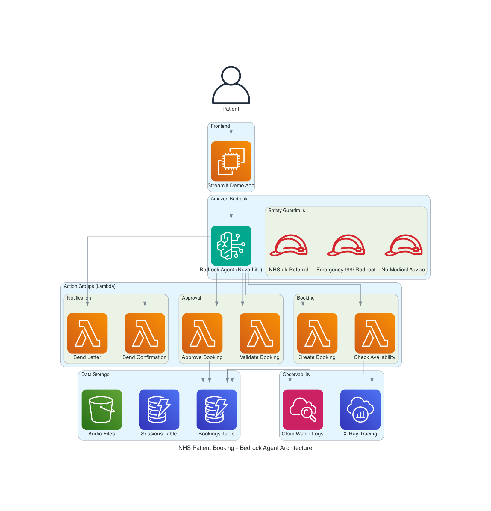

# Building an NHS Patient Booking Assistant with Amazon Bedrock Agents

## Introduction

Healthcare appointment booking is often a frustrating experience for patients. Long phone queues, limited online options, and complex navigation through healthcare systems create barriers to accessing care. What if patients could simply describe their needs in natural language and have an AI assistant handle the booking process?

In this blog post, we'll explore how to build an intelligent patient booking assistant using Amazon Bedrock Agents and Amazon Nova Lite. This demo application showcases how generative AI can streamline healthcare workflows while maintaining appropriate safety guardrails.

## The Business Challenge

Healthcare providers face several challenges with appointment booking:

- **High call volumes**: Reception staff spend significant time on routine booking calls
- **Limited availability**: Patients struggle to find convenient appointment times
- **Complex triage**: Determining urgency and routing to appropriate care
- **Communication gaps**: Missed confirmations and follow-ups

This solution addresses these challenges by providing a conversational AI interface that can:
- Understand patient booking requests in natural language
- Check availability and suggest appropriate slots
- Handle the booking workflow automatically
- Send confirmations via email/SMS

## Architecture

The NHS Patient Booking Assistant is built on a serverless architecture leveraging Amazon Bedrock Agents.



The architecture includes:

- **Frontend**: Streamlit demo app for patient text/voice interaction
- **Bedrock Agent**: Powered by Amazon Nova Lite for natural language understanding
- **Safety Guardrails**: 
  - No medical advice - agent only handles bookings
  - Emergency redirect - directs urgent symptoms to 999
  - NHS.uk referral - points patients to official NHS resources
- **Action Groups**: Six Lambda functions organized by purpose:
  - Booking: Check availability, Create booking
  - Approval: Validate booking, Approve booking  
  - Notification: Send confirmation, Send letter
- **Storage**: DynamoDB for bookings/sessions, S3 for audio files
- **Observability**: X-Ray tracing and CloudWatch logs

The flow works as follows:

1. Patient interacts with the Streamlit demo app via text or voice
2. The request is sent to the Bedrock Agent powered by Amazon Nova Lite
3. The agent determines the appropriate action and invokes Lambda
4. Lambda executes booking operations against DynamoDB
5. Confirmations are sent back through the agent to the patient

## Key Features

### 1. Natural Language Understanding

The Bedrock Agent uses Amazon Nova Lite to understand patient requests in natural language. Patients can say things like:

- "I need to see a GP about my headaches"
- "Can I book an urgent appointment for tomorrow?"
- "What slots are available next week?"

The agent interprets these requests and maps them to appropriate actions.

### 2. Action Groups with Lambda

The agent has access to several actions implemented as a Lambda function:

```python
def handler(event, context):
    """Main Lambda handler for Bedrock Agent actions."""
    
    api_path = event.get("apiPath", "")
    parameters = event.get("requestBody", {}).get("content", {}).get("application/json", {}).get("properties", [])
    params = {p["name"]: p["value"] for p in parameters}
    
    handlers = {
        "/check-availability": check_availability,
        "/create-booking": create_booking,
        "/approve-booking": approve_booking,
        "/send-confirmation": send_confirmation,
    }
    
    handler_func = handlers.get(api_path)
    result = handler_func(params) if handler_func else {"error": f"Unknown action: {api_path}"}
    
    return {
        "messageVersion": "1.0",
        "response": {
            "actionGroup": event.get("actionGroup", ""),
            "apiPath": api_path,
            "httpMethod": "POST",
            "httpStatusCode": 200,
            "responseBody": {
                "application/json": {"body": json.dumps(result)}
            }
        }
    }
```

### 3. Availability Checking

The `check_availability` action returns available appointment slots based on urgency:

```python
def check_availability(params):
    """Check available appointment slots."""
    
    urgency = params.get("urgency", "routine")
    today = datetime.now()
    slots = []
    
    if urgency == "urgent":
        # Same day or next day for urgent
        for i in range(2):
            date = today + timedelta(days=i)
            slots.append({
                "date": date.strftime("%Y-%m-%d"),
                "time": "09:30" if i == 0 else "14:00",
                "doctor": "Dr. Smith (Duty GP)",
                "type": "urgent"
            })
    else:
        # 1-2 weeks out for routine
        for i in range(7, 14, 2):
            date = today + timedelta(days=i)
            if date.weekday() < 5:
                slots.append({
                    "date": date.strftime("%Y-%m-%d"),
                    "time": "10:00",
                    "doctor": "Dr. Williams",
                    "type": "routine"
                })
    
    return {
        "available_slots": slots[:3],
        "message": f"Found {len(slots[:3])} available slots"
    }
```

### 4. Safety Guardrails

The agent is configured with important safety instructions:

```hcl
instruction = <<-EOT
  You are an NHS Patient Booking Assistant. Help patients book GP and specialist appointments.

  IMPORTANT RULES:
  1. You do NOT provide medical advice - only help with bookings
  2. For NHS information, direct patients to nhs.uk website
  3. Be polite, professional, and reassuring
  4. Keep patients updated on what you're doing

  EMERGENCY: For urgent symptoms (chest pain, breathing difficulty, stroke signs), 
  immediately advise calling 999 - do NOT proceed with booking.
EOT
```

### 5. X-Ray Tracing

Full observability is enabled through AWS X-Ray:

```hcl
resource "aws_lambda_function" "actions" {
  # ... other config ...
  
  tracing_config {
    mode = "Active"
  }
}
```

This allows monitoring of:
- Lambda invocation latency
- DynamoDB operation timing
- Error tracking and debugging

## Deploying the Application

### Prerequisites

- AWS Account with Bedrock access
- Amazon Nova Lite model enabled
- Terraform >= 1.5
- Python 3.11+

### Step 1: Enable Amazon Nova Lite

Navigate to the Amazon Bedrock console and request access to `amazon.nova-lite-v1:0` in your target region.

### Step 2: Deploy Infrastructure

```bash
git clone <repository>
cd patient_bookings/terraform
terraform init
terraform apply -auto-approve
```

The Terraform configuration creates:
- Bedrock Agent with Nova Lite
- Lambda function with X-Ray tracing
- DynamoDB tables for bookings and sessions
- S3 bucket for audio files
- IAM roles and permissions

### Step 3: Set Environment Variables

```bash
eval "$(terraform output -raw env_vars)"
```

### Step 4: Run the Demo

```bash
cd ../app
pip install streamlit boto3
streamlit run streamlit_app.py
```

## Using the Application

### Basic Booking Flow

1. **Start conversation**: "Hi, I need to book a GP appointment"
2. **Agent checks availability**: Returns available slots
3. **Select slot**: "I'll take the 10am on Monday"
4. **Provide details**: Name, reason for visit
5. **Confirmation**: Agent creates booking and sends confirmation

### Example Conversation

```
User: I need to see a GP about recurring headaches

Agent: I can help you book a GP appointment. Let me check availability for you.

I found 3 available slots:
- January 12, 2026 at 10:00 AM with Dr. Williams
- January 14, 2026 at 10:00 AM with Dr. Williams  
- January 16, 2026 at 10:00 AM with Dr. Williams

Which slot would you prefer?

User: January 14th please. My name is John Smith.

Agent: I've created your booking:
- Reference: NHS-20260105-A1B2C3
- Date: January 14, 2026
- Time: 10:00 AM
- Doctor: Dr. Williams

Would you like me to send a confirmation to your email or phone?
```

### Emergency Handling

```
User: I'm having chest pains

Agent: I'm concerned about your symptoms. Chest pain can be serious.

Please call 999 immediately or go to your nearest A&E.

I cannot proceed with a routine booking for these symptoms. Your health and safety are the priority.
```

## Testing

### Unit Tests

```bash
pytest tests/ -v
```

The test suite covers:
- Availability checking logic
- Booking creation and validation
- Approval workflow
- Notification sending

### Load Testing

```bash
cd load_tests
locust -f locustfile.py --headless -u 5 -r 1 -t 30s
```

## Cost Considerations

This demo is designed to be cost-effective:

| Service | Pricing | Demo Usage |
|---------|---------|------------|
| Bedrock (Nova Lite) | ~$0.00006/1K input tokens | Minimal |
| Lambda | Free tier: 1M requests/month | Covered |
| DynamoDB | On-demand: $1.25/million writes | Minimal |
| S3 | $0.023/GB/month | Minimal |

For a demo with ~100 conversations, expect costs under $1.

## Future Improvements

Several enhancements could extend this solution:

- **Voice Integration**: Add Amazon Transcribe for speech-to-text
- **Multi-language Support**: Leverage Nova's multilingual capabilities
- **Calendar Integration**: Connect to real appointment systems
- **SMS Reminders**: Automated appointment reminders via SNS
- **Analytics Dashboard**: Track booking patterns and agent performance

## Conclusion

This NHS Patient Booking Assistant demonstrates how Amazon Bedrock Agents can transform healthcare workflows. By combining:

- **Amazon Nova Lite** for natural language understanding
- **Lambda** for business logic execution
- **DynamoDB** for data persistence
- **X-Ray** for observability

We've created a conversational AI that can handle routine booking tasks while maintaining appropriate safety guardrails. This approach not only improves patient experience but also frees up healthcare staff to focus on more complex tasks.

The serverless architecture ensures the solution scales automatically and remains cost-effective, making it suitable for healthcare organizations of any size.

## References

- [Amazon Bedrock Agents Documentation](https://docs.aws.amazon.com/bedrock/latest/userguide/agents.html)
- [Amazon Nova Models](https://aws.amazon.com/ai/generative-ai/nova/)
- [NHS Patient Flow Improvement Guide](https://www.england.nhs.uk/improvement-hub/)
- [AWS Lambda with X-Ray](https://docs.aws.amazon.com/lambda/latest/dg/services-xray.html)
