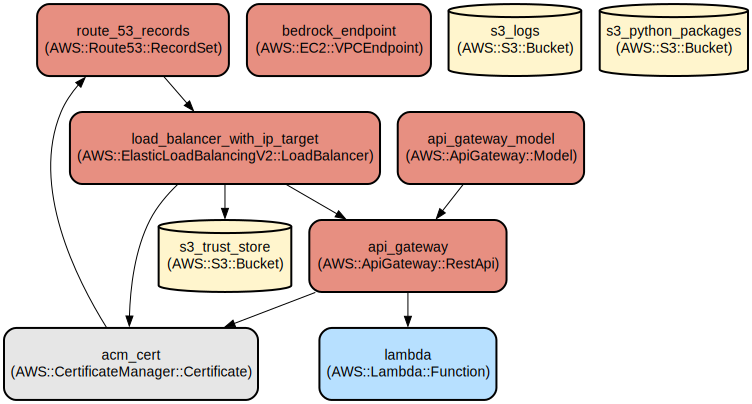

# Translation LLM Translation and AWS Polly

** Generated by Amazon Q Pro **

A serverless application that performs real-time translation using LLM and text to speech conversion using Polly.

## Architecture

The application consists of:

- AWS Lambda function for processing requests
- API Gateway with private endpoint configuration
- Application Load Balancer with mutual TLS authentication
- Amazon Bedrock integration for AI translation
- Amazon Translate as fallback translation service
- S3 buckets for logs, trust store, and Python packages

## Features

- Multi-language support:
- Real-time translation using Amazon Bedrock models (Titan and Mistral)
- Guardrails
- Support for chat conversations
- Name anonymization

## Infrastructure



The infrastructure is managed with Terraform and includes:

- Private API Gateway endpoint
- Internal Application Load Balancer
- ACM certificates for TLS
- Route 53 DNS records
- VPC endpoints for AWS services
- S3 buckets for various storage needs

## Security

The application implements several security measures:

- Private API Gateway endpoints
- Internal load balancer
- VPC isolation
- Request validation
- Input sanitization


### Prerequisites
- Terraform installed https://developer.hashicorp.com/terraform/install
- Terragrunt installed https://terragrunt.gruntwork.io/docs/getting-started/quick-start/
- AWS credentials configured for your account.
- Pre-commit installed (for code quality checks)


Set up virtual env to setup precommit dependencies.

```bash
# Create a virtual environment
python3 -m venv venv

# Activate the virtual environment
source venv/bin/activate

# Install dependencies
pip install -r requirements.txt
```


### Setting up Pre-commit Hooks

Before deploying, set up pre-commit hooks to ensure code quality:

```bash
# Install the pre-commit hooks
pre-commit install

# Run hooks against all files
pre-commit run --all-files
```

### Development Environment


```bash
# Change to the development environment directory for your target region
cd translation/terragrunt

# Plan changes
terragrunt plan

# Apply changes
terragrunt apply
```
